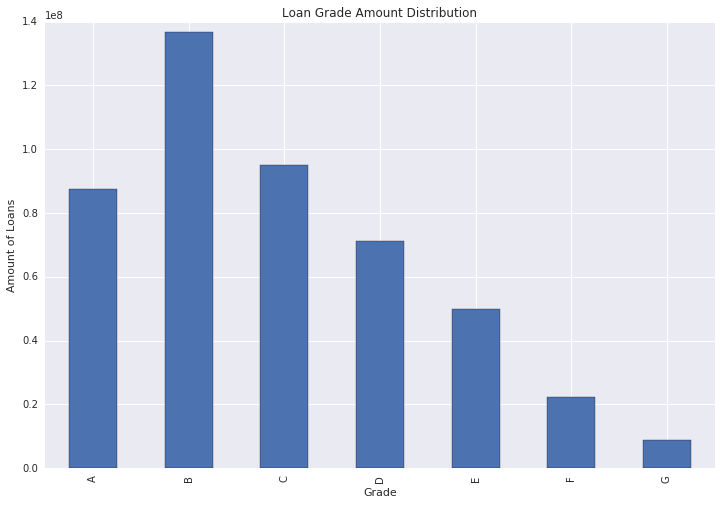

```python
import pandas as pd
import numpy as np
pd.set_option('max_columns', 120)
pd.set_option('max_colwidth', 5000)


import matplotlib.pyplot as plt
import seaborn as sns
%matplotlib inline
plt.rcParams['figure.figsize'] = (12,8)
```

#<b>Remove this code</b>


```python

# @hidden_cell
credentials_2 = {
  'auth_url':'https://identity.open.softlayer.com',
  'project':'object_storage_d81e0539_4836_4da9_ae62_9665be5a872c',
  'project_id':'eafe92ef21874fcbb43b1a813f667a6a',
  'region':'dallas',
  'user_id':'aa5b64b951294839b1afc0da800631dd',
  'domain_id':'7798bf9ad6564a1583f1f2af8c2a92de',
  'domain_name':'1257745',
  'username':'member_3b205d99c3934ac4fc5b44445d55858302b73bb1',
  'password':"""MD5({70Mx*{3L[^a""",
  'container':'LendingClubDataSet',
  'tenantId':'undefined',
  'filename':'LoanStats3a_securev1.csv'
}
```


```python


from io import StringIO
import requests
import json
import pandas as pd

# @hidden_cell
# This function accesses a file in your Object Storage. The definition contains your credentials.
# You might want to remove those credentials before you share your notebook.
def get_object_storage_file_with_credentials_d81e053948364da9ae629665be5a872c(container, filename):
    """This functions returns a StringIO object containing
    the file content from Bluemix Object Storage."""

    url1 = ''.join(['https://identity.open.softlayer.com', '/v3/auth/tokens'])
    data = {'auth': {'identity': {'methods': ['password'],
            'password': {'user': {'name': 'member_3b205d99c3934ac4fc5b44445d55858302b73bb1','domain': {'id': '7798bf9ad6564a1583f1f2af8c2a92de'},
            'password': 'MD5({70Mx*{3L[^a'}}}}}
    headers1 = {'Content-Type': 'application/json'}
    resp1 = requests.post(url=url1, data=json.dumps(data), headers=headers1)
    resp1_body = resp1.json()
    for e1 in resp1_body['token']['catalog']:
        if(e1['type']=='object-store'):
            for e2 in e1['endpoints']:
                        if(e2['interface']=='public'and e2['region']=='dallas'):
                            url2 = ''.join([e2['url'],'/', container, '/', filename])
    s_subject_token = resp1.headers['x-subject-token']
    headers2 = {'X-Auth-Token': s_subject_token, 'accept': 'application/json'}
    resp2 = requests.get(url=url2, headers=headers2)
    return StringIO(resp2.text)
```

# skip row 1 so pandas can parse the data properly.


```python

df_data_1 = pd.read_csv(get_object_storage_file_with_credentials_d81e053948364da9ae629665be5a872c('LendingClubDataSet', 'LoanStats3a_securev1.csv'), skiprows=1)
#df_data_1 = pd.read_csv('LoanStats3a_securev1.csv', skiprows=1)
df_data_1.head()

```

    /usr/local/src/conda3_runtime/4.1.1/lib/python3.5/site-packages/IPython/core/interactiveshell.py:2723: DtypeWarning: Columns (0,49) have mixed types. Specify dtype option on import or set low_memory=False.
      interactivity=interactivity, compiler=compiler, result=result)


<div>
<table border="1" class="dataframe">
  <thead>
    <tr style="text-align: right;">
      <th></th>
      <th>id</th>
      <th>member_id</th>
      <th>loan_amnt</th>
      <th>funded_amnt</th>
      <th>funded_amnt_inv</th>
      <th>term</th>
      <th>int_rate</th>
      <th>installment</th>
      <th>grade</th>
      <th>sub_grade</th>
      <th>emp_title</th>
      <th>emp_length</th>
      <th>home_ownership</th>
      <th>annual_inc</th>
      <th>verification_status</th>
      <th>issue_d</th>
      <th>loan_status</th>
      <th>pymnt_plan</th>
      <th>url</th>
      <th>desc</th>
      <th>purpose</th>
      <th>title</th>
      <th>zip_code</th>
      <th>addr_state</th>
      <th>dti</th>
      <th>delinq_2yrs</th>
      <th>earliest_cr_line</th>
      <th>fico_range_low</th>
      <th>fico_range_high</th>
      <th>inq_last_6mths</th>
      <th>mths_since_last_delinq</th>
      <th>mths_since_last_record</th>
      <th>open_acc</th>
      <th>pub_rec</th>
      <th>revol_bal</th>
      <th>revol_util</th>
      <th>total_acc</th>
      <th>initial_list_status</th>
      <th>out_prncp</th>
      <th>out_prncp_inv</th>
      <th>total_pymnt</th>
      <th>total_pymnt_inv</th>
      <th>total_rec_prncp</th>
      <th>total_rec_int</th>
      <th>total_rec_late_fee</th>
      <th>recoveries</th>
      <th>collection_recovery_fee</th>
      <th>last_pymnt_d</th>
      <th>last_pymnt_amnt</th>
      <th>next_pymnt_d</th>
      <th>last_credit_pull_d</th>
      <th>last_fico_range_high</th>
      <th>last_fico_range_low</th>
      <th>collections_12_mths_ex_med</th>
      <th>mths_since_last_major_derog</th>
      <th>policy_code</th>
      <th>application_type</th>
      <th>annual_inc_joint</th>
      <th>dti_joint</th>
      <th>verification_status_joint</th>
      <th>acc_now_delinq</th>
      <th>tot_coll_amt</th>
      <th>tot_cur_bal</th>
      <th>open_acc_6m</th>
      <th>open_il_6m</th>
      <th>open_il_12m</th>
      <th>open_il_24m</th>
      <th>mths_since_rcnt_il</th>
      <th>total_bal_il</th>
      <th>il_util</th>
      <th>open_rv_12m</th>
      <th>open_rv_24m</th>
      <th>max_bal_bc</th>
      <th>all_util</th>
      <th>total_rev_hi_lim</th>
      <th>inq_fi</th>
      <th>total_cu_tl</th>
      <th>inq_last_12m</th>
      <th>acc_open_past_24mths</th>
      <th>avg_cur_bal</th>
      <th>bc_open_to_buy</th>
      <th>bc_util</th>
      <th>chargeoff_within_12_mths</th>
      <th>delinq_amnt</th>
      <th>mo_sin_old_il_acct</th>
      <th>mo_sin_old_rev_tl_op</th>
      <th>mo_sin_rcnt_rev_tl_op</th>
      <th>mo_sin_rcnt_tl</th>
      <th>mort_acc</th>
      <th>mths_since_recent_bc</th>
      <th>mths_since_recent_bc_dlq</th>
      <th>mths_since_recent_inq</th>
      <th>mths_since_recent_revol_delinq</th>
      <th>num_accts_ever_120_pd</th>
      <th>num_actv_bc_tl</th>
      <th>num_actv_rev_tl</th>
      <th>num_bc_sats</th>
      <th>num_bc_tl</th>
      <th>num_il_tl</th>
      <th>num_op_rev_tl</th>
      <th>num_rev_accts</th>
      <th>num_rev_tl_bal_gt_0</th>
      <th>num_sats</th>
      <th>num_tl_120dpd_2m</th>
      <th>num_tl_30dpd</th>
      <th>num_tl_90g_dpd_24m</th>
      <th>num_tl_op_past_12m</th>
      <th>pct_tl_nvr_dlq</th>
      <th>percent_bc_gt_75</th>
      <th>pub_rec_bankruptcies</th>
      <th>tax_liens</th>
      <th>tot_hi_cred_lim</th>
      <th>total_bal_ex_mort</th>
      <th>total_bc_limit</th>
      <th>total_il_high_credit_limit</th>
    </tr>
  </thead>
  <tbody>
    <tr>
      <th>0</th>
      <td>1077501</td>
      <td>1296599.0</td>
      <td>5000.0</td>
      <td>5000.0</td>
      <td>4975.0</td>
      <td>36 months</td>
      <td>10.65%</td>
      <td>162.87</td>
      <td>B</td>
      <td>B2</td>
      <td>NaN</td>
      <td>10+ years</td>
      <td>RENT</td>
      <td>24000.0</td>
      <td>Verified</td>
      <td>Dec-2011</td>
      <td>Fully Paid</td>
      <td>n</td>
      <td>https://lendingclub.com/browse/loanDetail.action?loan_id=1077501</td>
      <td>Borrower added on 12/22/11 &gt; I need to upgrade my business technologies.&lt;br&gt;</td>
      <td>credit_card</td>
      <td>Computer</td>
      <td>860xx</td>
      <td>AZ</td>
      <td>27.65</td>
      <td>0.0</td>
      <td>Jan-1985</td>
      <td>735.0</td>
      <td>739.0</td>
      <td>1.0</td>
      <td>NaN</td>
      <td>NaN</td>
      <td>3.0</td>
      <td>0.0</td>
      <td>13648.0</td>
      <td>83.7%</td>
      <td>9.0</td>
      <td>f</td>
      <td>0.0</td>
      <td>0.0</td>
      <td>5863.155187</td>
      <td>5833.84</td>
      <td>5000.00</td>
      <td>863.16</td>
      <td>0.00</td>
      <td>0.0</td>
      <td>0.00</td>
      <td>Jan-2015</td>
      <td>171.62</td>
      <td>NaN</td>
      <td>Mar-2017</td>
      <td>754.0</td>
      <td>750.0</td>
      <td>0.0</td>
      <td>NaN</td>
      <td>1.0</td>
      <td>INDIVIDUAL</td>
      <td>NaN</td>
      <td>NaN</td>
      <td>NaN</td>
      <td>0.0</td>
      <td>NaN</td>
      <td>NaN</td>
      <td>NaN</td>
      <td>NaN</td>
      <td>NaN</td>
      <td>NaN</td>
      <td>NaN</td>
      <td>NaN</td>
      <td>NaN</td>
      <td>NaN</td>
      <td>NaN</td>
      <td>NaN</td>
      <td>NaN</td>
      <td>NaN</td>
      <td>NaN</td>
      <td>NaN</td>
      <td>NaN</td>
      <td>NaN</td>
      <td>NaN</td>
      <td>NaN</td>
      <td>NaN</td>
      <td>0.0</td>
      <td>0.0</td>
      <td>NaN</td>
      <td>NaN</td>
      <td>NaN</td>
      <td>NaN</td>
      <td>NaN</td>
      <td>NaN</td>
      <td>NaN</td>
      <td>NaN</td>
      <td>NaN</td>
      <td>NaN</td>
      <td>NaN</td>
      <td>NaN</td>
      <td>NaN</td>
      <td>NaN</td>
      <td>NaN</td>
      <td>NaN</td>
      <td>NaN</td>
      <td>NaN</td>
      <td>NaN</td>
      <td>NaN</td>
      <td>NaN</td>
      <td>NaN</td>
      <td>NaN</td>
      <td>NaN</td>
      <td>NaN</td>
      <td>0.0</td>
      <td>0.0</td>
      <td>NaN</td>
      <td>NaN</td>
      <td>NaN</td>
      <td>NaN</td>
    </tr>
    <tr>
      <th>1</th>
      <td>1077430</td>
      <td>1314167.0</td>
      <td>2500.0</td>
      <td>2500.0</td>
      <td>2500.0</td>
      <td>60 months</td>
      <td>15.27%</td>
      <td>59.83</td>
      <td>C</td>
      <td>C4</td>
      <td>Ryder</td>
      <td>&lt; 1 year</td>
      <td>RENT</td>
      <td>30000.0</td>
      <td>Source Verified</td>
      <td>Dec-2011</td>
      <td>Charged Off</td>
      <td>n</td>
      <td>https://lendingclub.com/browse/loanDetail.action?loan_id=1077430</td>
      <td>Borrower added on 12/22/11 &gt; I plan to use this money to finance the motorcycle i am looking at. I plan to have it paid off as soon as possible/when i sell my old bike. I only need this money because the deal im looking at is to good to pass up.&lt;br&gt;&lt;br&gt;  Borrower added on 12/22/11 &gt; I plan to use this money to finance the motorcycle i am looking at. I plan to have it paid off as soon as possible/when i sell my old bike.I only need this money because the deal im looking at is to good to pass up. I have finished college with an associates degree in business and its takingmeplaces&lt;br&gt;</td>
      <td>car</td>
      <td>bike</td>
      <td>309xx</td>
      <td>GA</td>
      <td>1.00</td>
      <td>0.0</td>
      <td>Apr-1999</td>
      <td>740.0</td>
      <td>744.0</td>
      <td>5.0</td>
      <td>NaN</td>
      <td>NaN</td>
      <td>3.0</td>
      <td>0.0</td>
      <td>1687.0</td>
      <td>9.4%</td>
      <td>4.0</td>
      <td>f</td>
      <td>0.0</td>
      <td>0.0</td>
      <td>1014.530000</td>
      <td>1014.53</td>
      <td>456.46</td>
      <td>435.17</td>
      <td>0.00</td>
      <td>122.9</td>
      <td>1.11</td>
      <td>Apr-2013</td>
      <td>119.66</td>
      <td>NaN</td>
      <td>Oct-2016</td>
      <td>499.0</td>
      <td>0.0</td>
      <td>0.0</td>
      <td>NaN</td>
      <td>1.0</td>
      <td>INDIVIDUAL</td>
      <td>NaN</td>
      <td>NaN</td>
      <td>NaN</td>
      <td>0.0</td>
      <td>NaN</td>
      <td>NaN</td>
      <td>NaN</td>
      <td>NaN</td>
      <td>NaN</td>
      <td>NaN</td>
      <td>NaN</td>
      <td>NaN</td>
      <td>NaN</td>
      <td>NaN</td>
      <td>NaN</td>
      <td>NaN</td>
      <td>NaN</td>
      <td>NaN</td>
      <td>NaN</td>
      <td>NaN</td>
      <td>NaN</td>
      <td>NaN</td>
      <td>NaN</td>
      <td>NaN</td>
      <td>NaN</td>
      <td>0.0</td>
      <td>0.0</td>
      <td>NaN</td>
      <td>NaN</td>
      <td>NaN</td>
      <td>NaN</td>
      <td>NaN</td>
      <td>NaN</td>
      <td>NaN</td>
      <td>NaN</td>
      <td>NaN</td>
      <td>NaN</td>
      <td>NaN</td>
      <td>NaN</td>
      <td>NaN</td>
      <td>NaN</td>
      <td>NaN</td>
      <td>NaN</td>
      <td>NaN</td>
      <td>NaN</td>
      <td>NaN</td>
      <td>NaN</td>
      <td>NaN</td>
      <td>NaN</td>
      <td>NaN</td>
      <td>NaN</td>
      <td>NaN</td>
      <td>0.0</td>
      <td>0.0</td>
      <td>NaN</td>
      <td>NaN</td>
      <td>NaN</td>
      <td>NaN</td>
    </tr>
    <tr>
      <th>2</th>
      <td>1077175</td>
      <td>1313524.0</td>
      <td>2400.0</td>
      <td>2400.0</td>
      <td>2400.0</td>
      <td>36 months</td>
      <td>15.96%</td>
      <td>84.33</td>
      <td>C</td>
      <td>C5</td>
      <td>NaN</td>
      <td>10+ years</td>
      <td>RENT</td>
      <td>12252.0</td>
      <td>Not Verified</td>
      <td>Dec-2011</td>
      <td>Fully Paid</td>
      <td>n</td>
      <td>https://lendingclub.com/browse/loanDetail.action?loan_id=1077175</td>
      <td>NaN</td>
      <td>small_business</td>
      <td>real estate business</td>
      <td>606xx</td>
      <td>IL</td>
      <td>8.72</td>
      <td>0.0</td>
      <td>Nov-2001</td>
      <td>735.0</td>
      <td>739.0</td>
      <td>2.0</td>
      <td>NaN</td>
      <td>NaN</td>
      <td>2.0</td>
      <td>0.0</td>
      <td>2956.0</td>
      <td>98.5%</td>
      <td>10.0</td>
      <td>f</td>
      <td>0.0</td>
      <td>0.0</td>
      <td>3005.666844</td>
      <td>3005.67</td>
      <td>2400.00</td>
      <td>605.67</td>
      <td>0.00</td>
      <td>0.0</td>
      <td>0.00</td>
      <td>Jun-2014</td>
      <td>649.91</td>
      <td>NaN</td>
      <td>Mar-2017</td>
      <td>684.0</td>
      <td>680.0</td>
      <td>0.0</td>
      <td>NaN</td>
      <td>1.0</td>
      <td>INDIVIDUAL</td>
      <td>NaN</td>
      <td>NaN</td>
      <td>NaN</td>
      <td>0.0</td>
      <td>NaN</td>
      <td>NaN</td>
      <td>NaN</td>
      <td>NaN</td>
      <td>NaN</td>
      <td>NaN</td>
      <td>NaN</td>
      <td>NaN</td>
      <td>NaN</td>
      <td>NaN</td>
      <td>NaN</td>
      <td>NaN</td>
      <td>NaN</td>
      <td>NaN</td>
      <td>NaN</td>
      <td>NaN</td>
      <td>NaN</td>
      <td>NaN</td>
      <td>NaN</td>
      <td>NaN</td>
      <td>NaN</td>
      <td>0.0</td>
      <td>0.0</td>
      <td>NaN</td>
      <td>NaN</td>
      <td>NaN</td>
      <td>NaN</td>
      <td>NaN</td>
      <td>NaN</td>
      <td>NaN</td>
      <td>NaN</td>
      <td>NaN</td>
      <td>NaN</td>
      <td>NaN</td>
      <td>NaN</td>
      <td>NaN</td>
      <td>NaN</td>
      <td>NaN</td>
      <td>NaN</td>
      <td>NaN</td>
      <td>NaN</td>
      <td>NaN</td>
      <td>NaN</td>
      <td>NaN</td>
      <td>NaN</td>
      <td>NaN</td>
      <td>NaN</td>
      <td>NaN</td>
      <td>0.0</td>
      <td>0.0</td>
      <td>NaN</td>
      <td>NaN</td>
      <td>NaN</td>
      <td>NaN</td>
    </tr>
    <tr>
      <th>3</th>
      <td>1076863</td>
      <td>1277178.0</td>
      <td>10000.0</td>
      <td>10000.0</td>
      <td>10000.0</td>
      <td>36 months</td>
      <td>13.49%</td>
      <td>339.31</td>
      <td>C</td>
      <td>C1</td>
      <td>AIR RESOURCES BOARD</td>
      <td>10+ years</td>
      <td>RENT</td>
      <td>49200.0</td>
      <td>Source Verified</td>
      <td>Dec-2011</td>
      <td>Fully Paid</td>
      <td>n</td>
      <td>https://lendingclub.com/browse/loanDetail.action?loan_id=1076863</td>
      <td>Borrower added on 12/21/11 &gt; to pay for property tax (borrow from friend, need to pay back) &amp; central A/C need to be replace. I'm very sorry to let my loan expired last time.&lt;br&gt;</td>
      <td>other</td>
      <td>personel</td>
      <td>917xx</td>
      <td>CA</td>
      <td>20.00</td>
      <td>0.0</td>
      <td>Feb-1996</td>
      <td>690.0</td>
      <td>694.0</td>
      <td>1.0</td>
      <td>35.0</td>
      <td>NaN</td>
      <td>10.0</td>
      <td>0.0</td>
      <td>5598.0</td>
      <td>21%</td>
      <td>37.0</td>
      <td>f</td>
      <td>0.0</td>
      <td>0.0</td>
      <td>12231.890000</td>
      <td>12231.89</td>
      <td>10000.00</td>
      <td>2214.92</td>
      <td>16.97</td>
      <td>0.0</td>
      <td>0.00</td>
      <td>Jan-2015</td>
      <td>357.48</td>
      <td>NaN</td>
      <td>Apr-2016</td>
      <td>604.0</td>
      <td>600.0</td>
      <td>0.0</td>
      <td>NaN</td>
      <td>1.0</td>
      <td>INDIVIDUAL</td>
      <td>NaN</td>
      <td>NaN</td>
      <td>NaN</td>
      <td>0.0</td>
      <td>NaN</td>
      <td>NaN</td>
      <td>NaN</td>
      <td>NaN</td>
      <td>NaN</td>
      <td>NaN</td>
      <td>NaN</td>
      <td>NaN</td>
      <td>NaN</td>
      <td>NaN</td>
      <td>NaN</td>
      <td>NaN</td>
      <td>NaN</td>
      <td>NaN</td>
      <td>NaN</td>
      <td>NaN</td>
      <td>NaN</td>
      <td>NaN</td>
      <td>NaN</td>
      <td>NaN</td>
      <td>NaN</td>
      <td>0.0</td>
      <td>0.0</td>
      <td>NaN</td>
      <td>NaN</td>
      <td>NaN</td>
      <td>NaN</td>
      <td>NaN</td>
      <td>NaN</td>
      <td>NaN</td>
      <td>NaN</td>
      <td>NaN</td>
      <td>NaN</td>
      <td>NaN</td>
      <td>NaN</td>
      <td>NaN</td>
      <td>NaN</td>
      <td>NaN</td>
      <td>NaN</td>
      <td>NaN</td>
      <td>NaN</td>
      <td>NaN</td>
      <td>NaN</td>
      <td>NaN</td>
      <td>NaN</td>
      <td>NaN</td>
      <td>NaN</td>
      <td>NaN</td>
      <td>0.0</td>
      <td>0.0</td>
      <td>NaN</td>
      <td>NaN</td>
      <td>NaN</td>
      <td>NaN</td>
    </tr>
    <tr>
      <th>4</th>
      <td>1075358</td>
      <td>1311748.0</td>
      <td>3000.0</td>
      <td>3000.0</td>
      <td>3000.0</td>
      <td>60 months</td>
      <td>12.69%</td>
      <td>67.79</td>
      <td>B</td>
      <td>B5</td>
      <td>University Medical Group</td>
      <td>1 year</td>
      <td>RENT</td>
      <td>80000.0</td>
      <td>Source Verified</td>
      <td>Dec-2011</td>
      <td>Fully Paid</td>
      <td>n</td>
      <td>https://lendingclub.com/browse/loanDetail.action?loan_id=1075358</td>
      <td>Borrower added on 12/21/11 &gt; I plan on combining three large interest bills together and freeing up some extra each month to pay toward other bills.  I've always been a good payor but have found myself needing to make adjustments to my budget due to a medical scare. My job is very stable, I love it.&lt;br&gt;</td>
      <td>other</td>
      <td>Personal</td>
      <td>972xx</td>
      <td>OR</td>
      <td>17.94</td>
      <td>0.0</td>
      <td>Jan-1996</td>
      <td>695.0</td>
      <td>699.0</td>
      <td>0.0</td>
      <td>38.0</td>
      <td>NaN</td>
      <td>15.0</td>
      <td>0.0</td>
      <td>27783.0</td>
      <td>53.9%</td>
      <td>38.0</td>
      <td>f</td>
      <td>0.0</td>
      <td>0.0</td>
      <td>4066.908161</td>
      <td>4066.91</td>
      <td>3000.00</td>
      <td>1066.91</td>
      <td>0.00</td>
      <td>0.0</td>
      <td>0.00</td>
      <td>Jan-2017</td>
      <td>67.30</td>
      <td>NaN</td>
      <td>Jan-2017</td>
      <td>694.0</td>
      <td>690.0</td>
      <td>0.0</td>
      <td>NaN</td>
      <td>1.0</td>
      <td>INDIVIDUAL</td>
      <td>NaN</td>
      <td>NaN</td>
      <td>NaN</td>
      <td>0.0</td>
      <td>NaN</td>
      <td>NaN</td>
      <td>NaN</td>
      <td>NaN</td>
      <td>NaN</td>
      <td>NaN</td>
      <td>NaN</td>
      <td>NaN</td>
      <td>NaN</td>
      <td>NaN</td>
      <td>NaN</td>
      <td>NaN</td>
      <td>NaN</td>
      <td>NaN</td>
      <td>NaN</td>
      <td>NaN</td>
      <td>NaN</td>
      <td>NaN</td>
      <td>NaN</td>
      <td>NaN</td>
      <td>NaN</td>
      <td>0.0</td>
      <td>0.0</td>
      <td>NaN</td>
      <td>NaN</td>
      <td>NaN</td>
      <td>NaN</td>
      <td>NaN</td>
      <td>NaN</td>
      <td>NaN</td>
      <td>NaN</td>
      <td>NaN</td>
      <td>NaN</td>
      <td>NaN</td>
      <td>NaN</td>
      <td>NaN</td>
      <td>NaN</td>
      <td>NaN</td>
      <td>NaN</td>
      <td>NaN</td>
      <td>NaN</td>
      <td>NaN</td>
      <td>NaN</td>
      <td>NaN</td>
      <td>NaN</td>
      <td>NaN</td>
      <td>NaN</td>
      <td>NaN</td>
      <td>0.0</td>
      <td>0.0</td>
      <td>NaN</td>
      <td>NaN</td>
      <td>NaN</td>
      <td>NaN</td>
    </tr>
  </tbody>
</table>
</div>


```python

df_data_3 = pd.read_csv(get_object_storage_file_with_credentials_d81e053948364da9ae629665be5a872c('LendingClubDataSet', 'LoanStats3a_securev1 2.csv'),skiprows=1)
df_data_3.head()

```

    /usr/local/src/conda3_runtime/4.1.1/lib/python3.5/site-packages/IPython/core/interactiveshell.py:2723: DtypeWarning: Columns (0,49) have mixed types. Specify dtype option on import or set low_memory=False.
      interactivity=interactivity, compiler=compiler, result=result)


<div>
<table border="1" class="dataframe">
  <thead>
    <tr style="text-align: right;">
      <th></th>
      <th>id</th>
      <th>member_id</th>
      <th>loan_amnt</th>
      <th>funded_amnt</th>
      <th>funded_amnt_inv</th>
      <th>term</th>
      <th>int_rate</th>
      <th>installment</th>
      <th>grade</th>
      <th>sub_grade</th>
      <th>emp_title</th>
      <th>emp_length</th>
      <th>home_ownership</th>
      <th>annual_inc</th>
      <th>verification_status</th>
      <th>issue_d</th>
      <th>loan_status</th>
      <th>pymnt_plan</th>
      <th>url</th>
      <th>desc</th>
      <th>purpose</th>
      <th>title</th>
      <th>zip_code</th>
      <th>addr_state</th>
      <th>dti</th>
      <th>delinq_2yrs</th>
      <th>earliest_cr_line</th>
      <th>fico_range_low</th>
      <th>fico_range_high</th>
      <th>inq_last_6mths</th>
      <th>mths_since_last_delinq</th>
      <th>mths_since_last_record</th>
      <th>open_acc</th>
      <th>pub_rec</th>
      <th>revol_bal</th>
      <th>revol_util</th>
      <th>total_acc</th>
      <th>initial_list_status</th>
      <th>out_prncp</th>
      <th>out_prncp_inv</th>
      <th>total_pymnt</th>
      <th>total_pymnt_inv</th>
      <th>total_rec_prncp</th>
      <th>total_rec_int</th>
      <th>total_rec_late_fee</th>
      <th>recoveries</th>
      <th>collection_recovery_fee</th>
      <th>last_pymnt_d</th>
      <th>last_pymnt_amnt</th>
      <th>next_pymnt_d</th>
      <th>last_credit_pull_d</th>
      <th>last_fico_range_high</th>
      <th>last_fico_range_low</th>
      <th>collections_12_mths_ex_med</th>
      <th>mths_since_last_major_derog</th>
      <th>policy_code</th>
      <th>application_type</th>
      <th>annual_inc_joint</th>
      <th>dti_joint</th>
      <th>verification_status_joint</th>
      <th>acc_now_delinq</th>
      <th>tot_coll_amt</th>
      <th>tot_cur_bal</th>
      <th>open_acc_6m</th>
      <th>open_il_6m</th>
      <th>open_il_12m</th>
      <th>open_il_24m</th>
      <th>mths_since_rcnt_il</th>
      <th>total_bal_il</th>
      <th>il_util</th>
      <th>open_rv_12m</th>
      <th>open_rv_24m</th>
      <th>max_bal_bc</th>
      <th>all_util</th>
      <th>total_rev_hi_lim</th>
      <th>inq_fi</th>
      <th>total_cu_tl</th>
      <th>inq_last_12m</th>
      <th>acc_open_past_24mths</th>
      <th>avg_cur_bal</th>
      <th>bc_open_to_buy</th>
      <th>bc_util</th>
      <th>chargeoff_within_12_mths</th>
      <th>delinq_amnt</th>
      <th>mo_sin_old_il_acct</th>
      <th>mo_sin_old_rev_tl_op</th>
      <th>mo_sin_rcnt_rev_tl_op</th>
      <th>mo_sin_rcnt_tl</th>
      <th>mort_acc</th>
      <th>mths_since_recent_bc</th>
      <th>mths_since_recent_bc_dlq</th>
      <th>mths_since_recent_inq</th>
      <th>mths_since_recent_revol_delinq</th>
      <th>num_accts_ever_120_pd</th>
      <th>num_actv_bc_tl</th>
      <th>num_actv_rev_tl</th>
      <th>num_bc_sats</th>
      <th>num_bc_tl</th>
      <th>num_il_tl</th>
      <th>num_op_rev_tl</th>
      <th>num_rev_accts</th>
      <th>num_rev_tl_bal_gt_0</th>
      <th>num_sats</th>
      <th>num_tl_120dpd_2m</th>
      <th>num_tl_30dpd</th>
      <th>num_tl_90g_dpd_24m</th>
      <th>num_tl_op_past_12m</th>
      <th>pct_tl_nvr_dlq</th>
      <th>percent_bc_gt_75</th>
      <th>pub_rec_bankruptcies</th>
      <th>tax_liens</th>
      <th>tot_hi_cred_lim</th>
      <th>total_bal_ex_mort</th>
      <th>total_bc_limit</th>
      <th>total_il_high_credit_limit</th>
    </tr>
  </thead>
  <tbody>
    <tr>
      <th>0</th>
      <td>1077501</td>
      <td>1296599.0</td>
      <td>5000.0</td>
      <td>5000.0</td>
      <td>4975.0</td>
      <td>36 months</td>
      <td>10.65%</td>
      <td>162.87</td>
      <td>B</td>
      <td>B2</td>
      <td>NaN</td>
      <td>10+ years</td>
      <td>RENT</td>
      <td>24000.0</td>
      <td>Verified</td>
      <td>Dec-2011</td>
      <td>Fully Paid</td>
      <td>n</td>
      <td>https://lendingclub.com/browse/loanDetail.action?loan_id=1077501</td>
      <td>Borrower added on 12/22/11 &gt; I need to upgrade my business technologies.&lt;br&gt;</td>
      <td>credit_card</td>
      <td>Computer</td>
      <td>860xx</td>
      <td>AZ</td>
      <td>27.65</td>
      <td>0.0</td>
      <td>Jan-1985</td>
      <td>735.0</td>
      <td>739.0</td>
      <td>1.0</td>
      <td>NaN</td>
      <td>NaN</td>
      <td>3.0</td>
      <td>0.0</td>
      <td>13648.0</td>
      <td>83.7%</td>
      <td>9.0</td>
      <td>f</td>
      <td>0.0</td>
      <td>0.0</td>
      <td>5863.155187</td>
      <td>5833.84</td>
      <td>5000.00</td>
      <td>863.16</td>
      <td>0.00</td>
      <td>0.0</td>
      <td>0.00</td>
      <td>Jan-2015</td>
      <td>171.62</td>
      <td>NaN</td>
      <td>Mar-2017</td>
      <td>754.0</td>
      <td>750.0</td>
      <td>0.0</td>
      <td>NaN</td>
      <td>1.0</td>
      <td>INDIVIDUAL</td>
      <td>NaN</td>
      <td>NaN</td>
      <td>NaN</td>
      <td>0.0</td>
      <td>NaN</td>
      <td>NaN</td>
      <td>NaN</td>
      <td>NaN</td>
      <td>NaN</td>
      <td>NaN</td>
      <td>NaN</td>
      <td>NaN</td>
      <td>NaN</td>
      <td>NaN</td>
      <td>NaN</td>
      <td>NaN</td>
      <td>NaN</td>
      <td>NaN</td>
      <td>NaN</td>
      <td>NaN</td>
      <td>NaN</td>
      <td>NaN</td>
      <td>NaN</td>
      <td>NaN</td>
      <td>NaN</td>
      <td>0.0</td>
      <td>0.0</td>
      <td>NaN</td>
      <td>NaN</td>
      <td>NaN</td>
      <td>NaN</td>
      <td>NaN</td>
      <td>NaN</td>
      <td>NaN</td>
      <td>NaN</td>
      <td>NaN</td>
      <td>NaN</td>
      <td>NaN</td>
      <td>NaN</td>
      <td>NaN</td>
      <td>NaN</td>
      <td>NaN</td>
      <td>NaN</td>
      <td>NaN</td>
      <td>NaN</td>
      <td>NaN</td>
      <td>NaN</td>
      <td>NaN</td>
      <td>NaN</td>
      <td>NaN</td>
      <td>NaN</td>
      <td>NaN</td>
      <td>0.0</td>
      <td>0.0</td>
      <td>NaN</td>
      <td>NaN</td>
      <td>NaN</td>
      <td>NaN</td>
    </tr>
    <tr>
      <th>1</th>
      <td>1077430</td>
      <td>1314167.0</td>
      <td>2500.0</td>
      <td>2500.0</td>
      <td>2500.0</td>
      <td>60 months</td>
      <td>15.27%</td>
      <td>59.83</td>
      <td>C</td>
      <td>C4</td>
      <td>Ryder</td>
      <td>&lt; 1 year</td>
      <td>RENT</td>
      <td>30000.0</td>
      <td>Source Verified</td>
      <td>Dec-2011</td>
      <td>Charged Off</td>
      <td>n</td>
      <td>https://lendingclub.com/browse/loanDetail.action?loan_id=1077430</td>
      <td>Borrower added on 12/22/11 &gt; I plan to use this money to finance the motorcycle i am looking at. I plan to have it paid off as soon as possible/when i sell my old bike. I only need this money because the deal im looking at is to good to pass up.&lt;br&gt;&lt;br&gt;  Borrower added on 12/22/11 &gt; I plan to use this money to finance the motorcycle i am looking at. I plan to have it paid off as soon as possible/when i sell my old bike.I only need this money because the deal im looking at is to good to pass up. I have finished college with an associates degree in business and its takingmeplaces&lt;br&gt;</td>
      <td>car</td>
      <td>bike</td>
      <td>309xx</td>
      <td>GA</td>
      <td>1.00</td>
      <td>0.0</td>
      <td>Apr-1999</td>
      <td>740.0</td>
      <td>744.0</td>
      <td>5.0</td>
      <td>NaN</td>
      <td>NaN</td>
      <td>3.0</td>
      <td>0.0</td>
      <td>1687.0</td>
      <td>9.4%</td>
      <td>4.0</td>
      <td>f</td>
      <td>0.0</td>
      <td>0.0</td>
      <td>1014.530000</td>
      <td>1014.53</td>
      <td>456.46</td>
      <td>435.17</td>
      <td>0.00</td>
      <td>122.9</td>
      <td>1.11</td>
      <td>Apr-2013</td>
      <td>119.66</td>
      <td>NaN</td>
      <td>Oct-2016</td>
      <td>499.0</td>
      <td>0.0</td>
      <td>0.0</td>
      <td>NaN</td>
      <td>1.0</td>
      <td>INDIVIDUAL</td>
      <td>NaN</td>
      <td>NaN</td>
      <td>NaN</td>
      <td>0.0</td>
      <td>NaN</td>
      <td>NaN</td>
      <td>NaN</td>
      <td>NaN</td>
      <td>NaN</td>
      <td>NaN</td>
      <td>NaN</td>
      <td>NaN</td>
      <td>NaN</td>
      <td>NaN</td>
      <td>NaN</td>
      <td>NaN</td>
      <td>NaN</td>
      <td>NaN</td>
      <td>NaN</td>
      <td>NaN</td>
      <td>NaN</td>
      <td>NaN</td>
      <td>NaN</td>
      <td>NaN</td>
      <td>NaN</td>
      <td>0.0</td>
      <td>0.0</td>
      <td>NaN</td>
      <td>NaN</td>
      <td>NaN</td>
      <td>NaN</td>
      <td>NaN</td>
      <td>NaN</td>
      <td>NaN</td>
      <td>NaN</td>
      <td>NaN</td>
      <td>NaN</td>
      <td>NaN</td>
      <td>NaN</td>
      <td>NaN</td>
      <td>NaN</td>
      <td>NaN</td>
      <td>NaN</td>
      <td>NaN</td>
      <td>NaN</td>
      <td>NaN</td>
      <td>NaN</td>
      <td>NaN</td>
      <td>NaN</td>
      <td>NaN</td>
      <td>NaN</td>
      <td>NaN</td>
      <td>0.0</td>
      <td>0.0</td>
      <td>NaN</td>
      <td>NaN</td>
      <td>NaN</td>
      <td>NaN</td>
    </tr>
    <tr>
      <th>2</th>
      <td>1077175</td>
      <td>1313524.0</td>
      <td>2400.0</td>
      <td>2400.0</td>
      <td>2400.0</td>
      <td>36 months</td>
      <td>15.96%</td>
      <td>84.33</td>
      <td>C</td>
      <td>C5</td>
      <td>NaN</td>
      <td>10+ years</td>
      <td>RENT</td>
      <td>12252.0</td>
      <td>Not Verified</td>
      <td>Dec-2011</td>
      <td>Fully Paid</td>
      <td>n</td>
      <td>https://lendingclub.com/browse/loanDetail.action?loan_id=1077175</td>
      <td>NaN</td>
      <td>small_business</td>
      <td>real estate business</td>
      <td>606xx</td>
      <td>IL</td>
      <td>8.72</td>
      <td>0.0</td>
      <td>Nov-2001</td>
      <td>735.0</td>
      <td>739.0</td>
      <td>2.0</td>
      <td>NaN</td>
      <td>NaN</td>
      <td>2.0</td>
      <td>0.0</td>
      <td>2956.0</td>
      <td>98.5%</td>
      <td>10.0</td>
      <td>f</td>
      <td>0.0</td>
      <td>0.0</td>
      <td>3005.666844</td>
      <td>3005.67</td>
      <td>2400.00</td>
      <td>605.67</td>
      <td>0.00</td>
      <td>0.0</td>
      <td>0.00</td>
      <td>Jun-2014</td>
      <td>649.91</td>
      <td>NaN</td>
      <td>Mar-2017</td>
      <td>684.0</td>
      <td>680.0</td>
      <td>0.0</td>
      <td>NaN</td>
      <td>1.0</td>
      <td>INDIVIDUAL</td>
      <td>NaN</td>
      <td>NaN</td>
      <td>NaN</td>
      <td>0.0</td>
      <td>NaN</td>
      <td>NaN</td>
      <td>NaN</td>
      <td>NaN</td>
      <td>NaN</td>
      <td>NaN</td>
      <td>NaN</td>
      <td>NaN</td>
      <td>NaN</td>
      <td>NaN</td>
      <td>NaN</td>
      <td>NaN</td>
      <td>NaN</td>
      <td>NaN</td>
      <td>NaN</td>
      <td>NaN</td>
      <td>NaN</td>
      <td>NaN</td>
      <td>NaN</td>
      <td>NaN</td>
      <td>NaN</td>
      <td>0.0</td>
      <td>0.0</td>
      <td>NaN</td>
      <td>NaN</td>
      <td>NaN</td>
      <td>NaN</td>
      <td>NaN</td>
      <td>NaN</td>
      <td>NaN</td>
      <td>NaN</td>
      <td>NaN</td>
      <td>NaN</td>
      <td>NaN</td>
      <td>NaN</td>
      <td>NaN</td>
      <td>NaN</td>
      <td>NaN</td>
      <td>NaN</td>
      <td>NaN</td>
      <td>NaN</td>
      <td>NaN</td>
      <td>NaN</td>
      <td>NaN</td>
      <td>NaN</td>
      <td>NaN</td>
      <td>NaN</td>
      <td>NaN</td>
      <td>0.0</td>
      <td>0.0</td>
      <td>NaN</td>
      <td>NaN</td>
      <td>NaN</td>
      <td>NaN</td>
    </tr>
    <tr>
      <th>3</th>
      <td>1076863</td>
      <td>1277178.0</td>
      <td>10000.0</td>
      <td>10000.0</td>
      <td>10000.0</td>
      <td>36 months</td>
      <td>13.49%</td>
      <td>339.31</td>
      <td>C</td>
      <td>C1</td>
      <td>AIR RESOURCES BOARD</td>
      <td>10+ years</td>
      <td>RENT</td>
      <td>49200.0</td>
      <td>Source Verified</td>
      <td>Dec-2011</td>
      <td>Fully Paid</td>
      <td>n</td>
      <td>https://lendingclub.com/browse/loanDetail.action?loan_id=1076863</td>
      <td>Borrower added on 12/21/11 &gt; to pay for property tax (borrow from friend, need to pay back) &amp; central A/C need to be replace. I'm very sorry to let my loan expired last time.&lt;br&gt;</td>
      <td>other</td>
      <td>personel</td>
      <td>917xx</td>
      <td>CA</td>
      <td>20.00</td>
      <td>0.0</td>
      <td>Feb-1996</td>
      <td>690.0</td>
      <td>694.0</td>
      <td>1.0</td>
      <td>35.0</td>
      <td>NaN</td>
      <td>10.0</td>
      <td>0.0</td>
      <td>5598.0</td>
      <td>21%</td>
      <td>37.0</td>
      <td>f</td>
      <td>0.0</td>
      <td>0.0</td>
      <td>12231.890000</td>
      <td>12231.89</td>
      <td>10000.00</td>
      <td>2214.92</td>
      <td>16.97</td>
      <td>0.0</td>
      <td>0.00</td>
      <td>Jan-2015</td>
      <td>357.48</td>
      <td>NaN</td>
      <td>Apr-2016</td>
      <td>604.0</td>
      <td>600.0</td>
      <td>0.0</td>
      <td>NaN</td>
      <td>1.0</td>
      <td>INDIVIDUAL</td>
      <td>NaN</td>
      <td>NaN</td>
      <td>NaN</td>
      <td>0.0</td>
      <td>NaN</td>
      <td>NaN</td>
      <td>NaN</td>
      <td>NaN</td>
      <td>NaN</td>
      <td>NaN</td>
      <td>NaN</td>
      <td>NaN</td>
      <td>NaN</td>
      <td>NaN</td>
      <td>NaN</td>
      <td>NaN</td>
      <td>NaN</td>
      <td>NaN</td>
      <td>NaN</td>
      <td>NaN</td>
      <td>NaN</td>
      <td>NaN</td>
      <td>NaN</td>
      <td>NaN</td>
      <td>NaN</td>
      <td>0.0</td>
      <td>0.0</td>
      <td>NaN</td>
      <td>NaN</td>
      <td>NaN</td>
      <td>NaN</td>
      <td>NaN</td>
      <td>NaN</td>
      <td>NaN</td>
      <td>NaN</td>
      <td>NaN</td>
      <td>NaN</td>
      <td>NaN</td>
      <td>NaN</td>
      <td>NaN</td>
      <td>NaN</td>
      <td>NaN</td>
      <td>NaN</td>
      <td>NaN</td>
      <td>NaN</td>
      <td>NaN</td>
      <td>NaN</td>
      <td>NaN</td>
      <td>NaN</td>
      <td>NaN</td>
      <td>NaN</td>
      <td>NaN</td>
      <td>0.0</td>
      <td>0.0</td>
      <td>NaN</td>
      <td>NaN</td>
      <td>NaN</td>
      <td>NaN</td>
    </tr>
    <tr>
      <th>4</th>
      <td>1075358</td>
      <td>1311748.0</td>
      <td>3000.0</td>
      <td>3000.0</td>
      <td>3000.0</td>
      <td>60 months</td>
      <td>12.69%</td>
      <td>67.79</td>
      <td>B</td>
      <td>B5</td>
      <td>University Medical Group</td>
      <td>1 year</td>
      <td>RENT</td>
      <td>80000.0</td>
      <td>Source Verified</td>
      <td>Dec-2011</td>
      <td>Fully Paid</td>
      <td>n</td>
      <td>https://lendingclub.com/browse/loanDetail.action?loan_id=1075358</td>
      <td>Borrower added on 12/21/11 &gt; I plan on combining three large interest bills together and freeing up some extra each month to pay toward other bills.  I've always been a good payor but have found myself needing to make adjustments to my budget due to a medical scare. My job is very stable, I love it.&lt;br&gt;</td>
      <td>other</td>
      <td>Personal</td>
      <td>972xx</td>
      <td>OR</td>
      <td>17.94</td>
      <td>0.0</td>
      <td>Jan-1996</td>
      <td>695.0</td>
      <td>699.0</td>
      <td>0.0</td>
      <td>38.0</td>
      <td>NaN</td>
      <td>15.0</td>
      <td>0.0</td>
      <td>27783.0</td>
      <td>53.9%</td>
      <td>38.0</td>
      <td>f</td>
      <td>0.0</td>
      <td>0.0</td>
      <td>4066.908161</td>
      <td>4066.91</td>
      <td>3000.00</td>
      <td>1066.91</td>
      <td>0.00</td>
      <td>0.0</td>
      <td>0.00</td>
      <td>Jan-2017</td>
      <td>67.30</td>
      <td>NaN</td>
      <td>Jan-2017</td>
      <td>694.0</td>
      <td>690.0</td>
      <td>0.0</td>
      <td>NaN</td>
      <td>1.0</td>
      <td>INDIVIDUAL</td>
      <td>NaN</td>
      <td>NaN</td>
      <td>NaN</td>
      <td>0.0</td>
      <td>NaN</td>
      <td>NaN</td>
      <td>NaN</td>
      <td>NaN</td>
      <td>NaN</td>
      <td>NaN</td>
      <td>NaN</td>
      <td>NaN</td>
      <td>NaN</td>
      <td>NaN</td>
      <td>NaN</td>
      <td>NaN</td>
      <td>NaN</td>
      <td>NaN</td>
      <td>NaN</td>
      <td>NaN</td>
      <td>NaN</td>
      <td>NaN</td>
      <td>NaN</td>
      <td>NaN</td>
      <td>NaN</td>
      <td>0.0</td>
      <td>0.0</td>
      <td>NaN</td>
      <td>NaN</td>
      <td>NaN</td>
      <td>NaN</td>
      <td>NaN</td>
      <td>NaN</td>
      <td>NaN</td>
      <td>NaN</td>
      <td>NaN</td>
      <td>NaN</td>
      <td>NaN</td>
      <td>NaN</td>
      <td>NaN</td>
      <td>NaN</td>
      <td>NaN</td>
      <td>NaN</td>
      <td>NaN</td>
      <td>NaN</td>
      <td>NaN</td>
      <td>NaN</td>
      <td>NaN</td>
      <td>NaN</td>
      <td>NaN</td>
      <td>NaN</td>
      <td>NaN</td>
      <td>0.0</td>
      <td>0.0</td>
      <td>NaN</td>
      <td>NaN</td>
      <td>NaN</td>
      <td>NaN</td>
    </tr>
  </tbody>
</table>
</div>


 # Drop any column with more than 50% missing values


```python

loans_2007 = df_data_1
half_count = len(loans_2007) / 2
loans_2007 = loans_2007.dropna(thresh=half_count,axis=1) # Drop any column with more than 50% missing values
loans_2007 = loans_2007.drop(['url','desc'],axis=1)  # These columns are not useful for our purposes
```


```python
loans_2007.head(3)
```


<div>
<table border="1" class="dataframe">
  <thead>
    <tr style="text-align: right;">
      <th></th>
      <th>id</th>
      <th>member_id</th>
      <th>loan_amnt</th>
      <th>funded_amnt</th>
      <th>funded_amnt_inv</th>
      <th>term</th>
      <th>int_rate</th>
      <th>installment</th>
      <th>grade</th>
      <th>sub_grade</th>
      <th>emp_title</th>
      <th>emp_length</th>
      <th>home_ownership</th>
      <th>annual_inc</th>
      <th>verification_status</th>
      <th>issue_d</th>
      <th>loan_status</th>
      <th>pymnt_plan</th>
      <th>purpose</th>
      <th>title</th>
      <th>zip_code</th>
      <th>addr_state</th>
      <th>dti</th>
      <th>delinq_2yrs</th>
      <th>earliest_cr_line</th>
      <th>fico_range_low</th>
      <th>fico_range_high</th>
      <th>inq_last_6mths</th>
      <th>open_acc</th>
      <th>pub_rec</th>
      <th>revol_bal</th>
      <th>revol_util</th>
      <th>total_acc</th>
      <th>initial_list_status</th>
      <th>out_prncp</th>
      <th>out_prncp_inv</th>
      <th>total_pymnt</th>
      <th>total_pymnt_inv</th>
      <th>total_rec_prncp</th>
      <th>total_rec_int</th>
      <th>total_rec_late_fee</th>
      <th>recoveries</th>
      <th>collection_recovery_fee</th>
      <th>last_pymnt_d</th>
      <th>last_pymnt_amnt</th>
      <th>last_credit_pull_d</th>
      <th>last_fico_range_high</th>
      <th>last_fico_range_low</th>
      <th>collections_12_mths_ex_med</th>
      <th>policy_code</th>
      <th>application_type</th>
      <th>acc_now_delinq</th>
      <th>chargeoff_within_12_mths</th>
      <th>delinq_amnt</th>
      <th>pub_rec_bankruptcies</th>
      <th>tax_liens</th>
    </tr>
  </thead>
  <tbody>
    <tr>
      <th>0</th>
      <td>1077501</td>
      <td>1296599.0</td>
      <td>5000.0</td>
      <td>5000.0</td>
      <td>4975.0</td>
      <td>36 months</td>
      <td>10.65%</td>
      <td>162.87</td>
      <td>B</td>
      <td>B2</td>
      <td>NaN</td>
      <td>10+ years</td>
      <td>RENT</td>
      <td>24000.0</td>
      <td>Verified</td>
      <td>Dec-2011</td>
      <td>Fully Paid</td>
      <td>n</td>
      <td>credit_card</td>
      <td>Computer</td>
      <td>860xx</td>
      <td>AZ</td>
      <td>27.65</td>
      <td>0.0</td>
      <td>Jan-1985</td>
      <td>735.0</td>
      <td>739.0</td>
      <td>1.0</td>
      <td>3.0</td>
      <td>0.0</td>
      <td>13648.0</td>
      <td>83.7%</td>
      <td>9.0</td>
      <td>f</td>
      <td>0.0</td>
      <td>0.0</td>
      <td>5863.155187</td>
      <td>5833.84</td>
      <td>5000.00</td>
      <td>863.16</td>
      <td>0.0</td>
      <td>0.0</td>
      <td>0.00</td>
      <td>Jan-2015</td>
      <td>171.62</td>
      <td>Mar-2017</td>
      <td>754.0</td>
      <td>750.0</td>
      <td>0.0</td>
      <td>1.0</td>
      <td>INDIVIDUAL</td>
      <td>0.0</td>
      <td>0.0</td>
      <td>0.0</td>
      <td>0.0</td>
      <td>0.0</td>
    </tr>
    <tr>
      <th>1</th>
      <td>1077430</td>
      <td>1314167.0</td>
      <td>2500.0</td>
      <td>2500.0</td>
      <td>2500.0</td>
      <td>60 months</td>
      <td>15.27%</td>
      <td>59.83</td>
      <td>C</td>
      <td>C4</td>
      <td>Ryder</td>
      <td>&lt; 1 year</td>
      <td>RENT</td>
      <td>30000.0</td>
      <td>Source Verified</td>
      <td>Dec-2011</td>
      <td>Charged Off</td>
      <td>n</td>
      <td>car</td>
      <td>bike</td>
      <td>309xx</td>
      <td>GA</td>
      <td>1.00</td>
      <td>0.0</td>
      <td>Apr-1999</td>
      <td>740.0</td>
      <td>744.0</td>
      <td>5.0</td>
      <td>3.0</td>
      <td>0.0</td>
      <td>1687.0</td>
      <td>9.4%</td>
      <td>4.0</td>
      <td>f</td>
      <td>0.0</td>
      <td>0.0</td>
      <td>1014.530000</td>
      <td>1014.53</td>
      <td>456.46</td>
      <td>435.17</td>
      <td>0.0</td>
      <td>122.9</td>
      <td>1.11</td>
      <td>Apr-2013</td>
      <td>119.66</td>
      <td>Oct-2016</td>
      <td>499.0</td>
      <td>0.0</td>
      <td>0.0</td>
      <td>1.0</td>
      <td>INDIVIDUAL</td>
      <td>0.0</td>
      <td>0.0</td>
      <td>0.0</td>
      <td>0.0</td>
      <td>0.0</td>
    </tr>
    <tr>
      <th>2</th>
      <td>1077175</td>
      <td>1313524.0</td>
      <td>2400.0</td>
      <td>2400.0</td>
      <td>2400.0</td>
      <td>36 months</td>
      <td>15.96%</td>
      <td>84.33</td>
      <td>C</td>
      <td>C5</td>
      <td>NaN</td>
      <td>10+ years</td>
      <td>RENT</td>
      <td>12252.0</td>
      <td>Not Verified</td>
      <td>Dec-2011</td>
      <td>Fully Paid</td>
      <td>n</td>
      <td>small_business</td>
      <td>real estate business</td>
      <td>606xx</td>
      <td>IL</td>
      <td>8.72</td>
      <td>0.0</td>
      <td>Nov-2001</td>
      <td>735.0</td>
      <td>739.0</td>
      <td>2.0</td>
      <td>2.0</td>
      <td>0.0</td>
      <td>2956.0</td>
      <td>98.5%</td>
      <td>10.0</td>
      <td>f</td>
      <td>0.0</td>
      <td>0.0</td>
      <td>3005.666844</td>
      <td>3005.67</td>
      <td>2400.00</td>
      <td>605.67</td>
      <td>0.0</td>
      <td>0.0</td>
      <td>0.00</td>
      <td>Jun-2014</td>
      <td>649.91</td>
      <td>Mar-2017</td>
      <td>684.0</td>
      <td>680.0</td>
      <td>0.0</td>
      <td>1.0</td>
      <td>INDIVIDUAL</td>
      <td>0.0</td>
      <td>0.0</td>
      <td>0.0</td>
      <td>0.0</td>
      <td>0.0</td>
    </tr>
  </tbody>
</table>
</div>


```python
loans_2007.shape

```


    (42538, 56)


 # Adding Data Dictionary Provided by Lending Club Dataset. 
 #converted excel to csv file


```python

df_data_2 = pd.read_csv(get_object_storage_file_with_credentials_d81e053948364da9ae629665be5a872c('LendingClubDataSet', 'LCDataDictionary.csv'))
#df_data_2 = pd.read_csv('LCDataDictionary.csv')
df_data_2.head()

```


<div>
<table border="1" class="dataframe">
  <thead>
    <tr style="text-align: right;">
      <th></th>
      <th>LoanStatNew</th>
      <th>Description</th>
      <th>Unnamed: 2</th>
      <th>Unnamed: 3</th>
      <th>Unnamed: 4</th>
      <th>Unnamed: 5</th>
      <th>Unnamed: 6</th>
      <th>Unnamed: 7</th>
      <th>Unnamed: 8</th>
      <th>Unnamed: 9</th>
      <th>Unnamed: 10</th>
    </tr>
  </thead>
  <tbody>
    <tr>
      <th>0</th>
      <td>zip_code</td>
      <td>The first 3 numbers of the zip code provided by the borrower in the loan application.</td>
      <td>NaN</td>
      <td>NaN</td>
      <td>NaN</td>
      <td>NaN</td>
      <td>NaN</td>
      <td>NaN</td>
      <td>NaN</td>
      <td>NaN</td>
      <td>NaN</td>
    </tr>
    <tr>
      <th>1</th>
      <td>addr_state</td>
      <td>The state provided by the borrower in the loan application</td>
      <td>NaN</td>
      <td>NaN</td>
      <td>NaN</td>
      <td>NaN</td>
      <td>NaN</td>
      <td>NaN</td>
      <td>NaN</td>
      <td>NaN</td>
      <td>NaN</td>
    </tr>
    <tr>
      <th>2</th>
      <td>annual_inc</td>
      <td>The annual income provided by the borrower during registration.</td>
      <td>NaN</td>
      <td>NaN</td>
      <td>NaN</td>
      <td>NaN</td>
      <td>NaN</td>
      <td>NaN</td>
      <td>NaN</td>
      <td>NaN</td>
      <td>NaN</td>
    </tr>
    <tr>
      <th>3</th>
      <td>collection_recovery_fee</td>
      <td>post charge off collection fee</td>
      <td>NaN</td>
      <td>NaN</td>
      <td>NaN</td>
      <td>NaN</td>
      <td>NaN</td>
      <td>NaN</td>
      <td>NaN</td>
      <td>NaN</td>
      <td>NaN</td>
    </tr>
    <tr>
      <th>4</th>
      <td>collections_12_mths_ex_med</td>
      <td>Number of collections in 12 months excluding medical collections</td>
      <td>NaN</td>
      <td>NaN</td>
      <td>NaN</td>
      <td>NaN</td>
      <td>NaN</td>
      <td>NaN</td>
      <td>NaN</td>
      <td>NaN</td>
      <td>NaN</td>
    </tr>
  </tbody>
</table>
</div>


```python
data_dictionary = df_data_2 # Loading in the data dictionary
print(data_dictionary.shape[0])
print(data_dictionary.columns.tolist())
```

    58
    ['LoanStatNew', 'Description', 'Unnamed: 2', 'Unnamed: 3', 'Unnamed: 4', 'Unnamed: 5', 'Unnamed: 6', 'Unnamed: 7', 'Unnamed: 8', 'Unnamed: 9', 'Unnamed: 10']


```python
data_dictionary.head()
data_dictionary = data_dictionary.rename(columns={'LoanStatNew': 'name',
                                                 'Description': 'description'})
```


```python

data_dictionary=data_dictionary.dropna(axis=1,how='all')
data_dictionary.head()


```


<div>
<table border="1" class="dataframe">
  <thead>
    <tr style="text-align: right;">
      <th></th>
      <th>name</th>
      <th>description</th>
    </tr>
  </thead>
  <tbody>
    <tr>
      <th>0</th>
      <td>zip_code</td>
      <td>The first 3 numbers of the zip code provided by the borrower in the loan application.</td>
    </tr>
    <tr>
      <th>1</th>
      <td>addr_state</td>
      <td>The state provided by the borrower in the loan application</td>
    </tr>
    <tr>
      <th>2</th>
      <td>annual_inc</td>
      <td>The annual income provided by the borrower during registration.</td>
    </tr>
    <tr>
      <th>3</th>
      <td>collection_recovery_fee</td>
      <td>post charge off collection fee</td>
    </tr>
    <tr>
      <th>4</th>
      <td>collections_12_mths_ex_med</td>
      <td>Number of collections in 12 months excluding medical collections</td>
    </tr>
  </tbody>
</table>
</div>


```python
loans_2007_dtypes = pd.DataFrame(loans_2007.dtypes,columns=['dtypes'])
loans_2007_dtypes = loans_2007_dtypes.reset_index()
loans_2007_dtypes['name'] = loans_2007_dtypes['index']
loans_2007_dtypes = loans_2007_dtypes[['name','dtypes']]

loans_2007_dtypes['first value'] = loans_2007.loc[0].values
analysis = loans_2007_dtypes.merge(data_dictionary, on='name',how='left')
```


```python
loans_2007['issue_d'].dtype
```


    dtype('O')


```python
loans_2007['issue_d'] = pd.to_datetime(loans_2007.issue_d)
loans_2007.groupby('issue_d')['loan_amnt'].sum().plot()
plt.title('Trends of loans amount issued')
plt.xlabel('Year')
plt.ylabel('Loan Amount')

                              
```


    <matplotlib.text.Text at 0x7f58e393bd30>


```python
loans_2007['issue_Y'] = loans_2007['issue_d'].dt.year
temp = loans_2007.groupby(['grade','issue_Y'],as_index=False)['id'].count()

import matplotlib.cm as cm
dpoints = np.array(temp)
fig = plt.figure(figsize=(15,7))
ax = fig.add_subplot(1,1,1)
space = 0.3
conditions = np.unique(dpoints[:,0])
categories = np.unique(dpoints[:,1])
n = len(conditions)
width = (1-space)/len(conditions)

for i,cond in enumerate(conditions):
    vals = dpoints[dpoints[:,0] == cond][:,2].astype(np.float)
    pos = [j - (1 - space) / 2. + i * width for j in range(1,len(categories)+1)]
    ax.bar(pos, vals, width = width,label=cond, 
       color=cm.Accent(float(i) / n))
    ax.set_xticklabels(['','2008','2010','2012','2014',''])
    handles, labels = ax.get_legend_handles_labels()
    ax.legend(handles[::-1], labels[::-1])
    ax.set_ylabel("Loan Volume")
    ax.set_xlabel("Year")
plt.title('Loan Volume Trends by Grade')


```


    <matplotlib.text.Text at 0x7f58db626048>


# So new Data frame preview contains 
<table>
<tr>
<h4>name</h4><p>Column Names</p></tr>
<tr>
<h4>dtypes</h4><p>Dtypes of columns</p></tr>
<tr>
<h4>first value</h4><p>first value</p></tr>
<tr>
<h4>description</h4><p>Description of columns</p></tr>
</table>


```python
analysis.head()
```


<div>
<table border="1" class="dataframe">
  <thead>
    <tr style="text-align: right;">
      <th></th>
      <th>name</th>
      <th>dtypes</th>
      <th>first value</th>
      <th>description</th>
    </tr>
  </thead>
  <tbody>
    <tr>
      <th>0</th>
      <td>id</td>
      <td>object</td>
      <td>1077501</td>
      <td>A unique LC assigned ID for the loan listing.</td>
    </tr>
    <tr>
      <th>1</th>
      <td>member_id</td>
      <td>float64</td>
      <td>1.2966e+06</td>
      <td>A unique LC assigned Id for the borrower member.</td>
    </tr>
    <tr>
      <th>2</th>
      <td>loan_amnt</td>
      <td>float64</td>
      <td>5000</td>
      <td>The listed amount of the loan applied for by the borrower. If at some point in time, the credit department reduces the loan amount, then it will be reflected in this value.</td>
    </tr>
    <tr>
      <th>3</th>
      <td>funded_amnt</td>
      <td>float64</td>
      <td>5000</td>
      <td>The total amount committed to that loan at that point in time.</td>
    </tr>
    <tr>
      <th>4</th>
      <td>funded_amnt_inv</td>
      <td>float64</td>
      <td>4975</td>
      <td>The total amount committed by investors for that loan at that point in time.</td>
    </tr>
  </tbody>
</table>
</div>


```python
analysis[:19]
```


<div>
<table border="1" class="dataframe">
  <thead>
    <tr style="text-align: right;">
      <th></th>
      <th>name</th>
      <th>dtypes</th>
      <th>first value</th>
      <th>description</th>
    </tr>
  </thead>
  <tbody>
    <tr>
      <th>0</th>
      <td>id</td>
      <td>object</td>
      <td>1077501</td>
      <td>A unique LC assigned ID for the loan listing.</td>
    </tr>
    <tr>
      <th>1</th>
      <td>member_id</td>
      <td>float64</td>
      <td>1.2966e+06</td>
      <td>A unique LC assigned Id for the borrower member.</td>
    </tr>
    <tr>
      <th>2</th>
      <td>loan_amnt</td>
      <td>float64</td>
      <td>5000</td>
      <td>The listed amount of the loan applied for by the borrower. If at some point in time, the credit department reduces the loan amount, then it will be reflected in this value.</td>
    </tr>
    <tr>
      <th>3</th>
      <td>funded_amnt</td>
      <td>float64</td>
      <td>5000</td>
      <td>The total amount committed to that loan at that point in time.</td>
    </tr>
    <tr>
      <th>4</th>
      <td>funded_amnt_inv</td>
      <td>float64</td>
      <td>4975</td>
      <td>The total amount committed by investors for that loan at that point in time.</td>
    </tr>
    <tr>
      <th>5</th>
      <td>term</td>
      <td>object</td>
      <td>36 months</td>
      <td>The number of payments on the loan. Values are in months and can be either 36 or 60.</td>
    </tr>
    <tr>
      <th>6</th>
      <td>int_rate</td>
      <td>object</td>
      <td>10.65%</td>
      <td>Interest Rate on the loan</td>
    </tr>
    <tr>
      <th>7</th>
      <td>installment</td>
      <td>float64</td>
      <td>162.87</td>
      <td>The monthly payment owed by the borrower if the loan originates.</td>
    </tr>
    <tr>
      <th>8</th>
      <td>grade</td>
      <td>object</td>
      <td>B</td>
      <td>LC assigned loan grade</td>
    </tr>
    <tr>
      <th>9</th>
      <td>sub_grade</td>
      <td>object</td>
      <td>B2</td>
      <td>LC assigned loan subgrade</td>
    </tr>
    <tr>
      <th>10</th>
      <td>emp_title</td>
      <td>object</td>
      <td>NaN</td>
      <td>The job title supplied by the Borrower when applying for the loan.*</td>
    </tr>
    <tr>
      <th>11</th>
      <td>emp_length</td>
      <td>object</td>
      <td>10+ years</td>
      <td>Employment length in years. Possible values are between 0 and 10 where 0 means less than one year and 10 means ten or more years.</td>
    </tr>
    <tr>
      <th>12</th>
      <td>home_ownership</td>
      <td>object</td>
      <td>RENT</td>
      <td>The home ownership status provided by the borrower during registration. Our values are: RENT, OWN, MORTGAGE, OTHER.</td>
    </tr>
    <tr>
      <th>13</th>
      <td>annual_inc</td>
      <td>float64</td>
      <td>24000</td>
      <td>The annual income provided by the borrower during registration.</td>
    </tr>
    <tr>
      <th>14</th>
      <td>verification_status</td>
      <td>object</td>
      <td>Verified</td>
      <td>NaN</td>
    </tr>
    <tr>
      <th>15</th>
      <td>issue_d</td>
      <td>object</td>
      <td>Dec-2011</td>
      <td>The month which the loan was funded</td>
    </tr>
    <tr>
      <th>16</th>
      <td>loan_status</td>
      <td>object</td>
      <td>Fully Paid</td>
      <td>Current status of the loan</td>
    </tr>
    <tr>
      <th>17</th>
      <td>pymnt_plan</td>
      <td>object</td>
      <td>n</td>
      <td>Indicates if a payment plan has been put in place for the loan</td>
    </tr>
    <tr>
      <th>18</th>
      <td>purpose</td>
      <td>object</td>
      <td>credit_card</td>
      <td>A category provided by the borrower for the loan request.</td>
    </tr>
  </tbody>
</table>
</div>


# Analysis of first 19 columns 
<p>columns to be removed</p>
<p>id - Randomly genereated Unique Identification Number </p>
<p>member_id - randomly generated field by identification purposes</p>
<p>funded_amnt - Gives future information</p>
<p>funded_amnt_inv - Gives future information</p>
<p>sub_grade - Already defined in grade</p>
<p>int_rate - Already included in grade</p>
<p>emp_title - not much useful unless mapped wiht other information</p>
<p>issued_d - Gives future information</p>


```python
drop_list = ['id','member_id','funded_amnt','funded_amnt_inv',
             'int_rate','sub_grade','emp_title','issue_d']
loans_2007 = loans_2007.drop(drop_list,axis=1)
```


```python
analysis[19:38]
```


<div>
<table border="1" class="dataframe">
  <thead>
    <tr style="text-align: right;">
      <th></th>
      <th>name</th>
      <th>dtypes</th>
      <th>first value</th>
      <th>description</th>
    </tr>
  </thead>
  <tbody>
    <tr>
      <th>19</th>
      <td>title</td>
      <td>object</td>
      <td>Computer</td>
      <td>The loan title provided by the borrower</td>
    </tr>
    <tr>
      <th>20</th>
      <td>zip_code</td>
      <td>object</td>
      <td>860xx</td>
      <td>The first 3 numbers of the zip code provided by the borrower in the loan application.</td>
    </tr>
    <tr>
      <th>21</th>
      <td>addr_state</td>
      <td>object</td>
      <td>AZ</td>
      <td>The state provided by the borrower in the loan application</td>
    </tr>
    <tr>
      <th>22</th>
      <td>dti</td>
      <td>float64</td>
      <td>27.65</td>
      <td>A ratio calculated using the borrowers total monthly debt payments on the total debt obligations, excluding mortgage and the requested LC loan, divided by the borrowers self-reported monthly income.</td>
    </tr>
    <tr>
      <th>23</th>
      <td>delinq_2yrs</td>
      <td>float64</td>
      <td>0</td>
      <td>The number of 30+ days past-due incidences of delinquency in the borrower's credit file for the past 2 years</td>
    </tr>
    <tr>
      <th>24</th>
      <td>earliest_cr_line</td>
      <td>object</td>
      <td>Jan-1985</td>
      <td>The month the borrower's earliest reported credit line was opened</td>
    </tr>
    <tr>
      <th>25</th>
      <td>fico_range_low</td>
      <td>float64</td>
      <td>735</td>
      <td>The lower boundary of range the borrowers FICO belongs to.</td>
    </tr>
    <tr>
      <th>26</th>
      <td>fico_range_high</td>
      <td>float64</td>
      <td>739</td>
      <td>The upper boundary of range the borrowers FICO belongs to.</td>
    </tr>
    <tr>
      <th>27</th>
      <td>inq_last_6mths</td>
      <td>float64</td>
      <td>1</td>
      <td>The number of inquiries by creditors during the past 6 months.</td>
    </tr>
    <tr>
      <th>28</th>
      <td>open_acc</td>
      <td>float64</td>
      <td>3</td>
      <td>The number of open credit lines in the borrower's credit file.</td>
    </tr>
    <tr>
      <th>29</th>
      <td>pub_rec</td>
      <td>float64</td>
      <td>0</td>
      <td>Number of derogatory public records</td>
    </tr>
    <tr>
      <th>30</th>
      <td>revol_bal</td>
      <td>float64</td>
      <td>13648</td>
      <td>Total credit revolving balance</td>
    </tr>
    <tr>
      <th>31</th>
      <td>revol_util</td>
      <td>object</td>
      <td>83.7%</td>
      <td>Revolving line utilization rate, or the amount of credit the borrower is using relative to all available revolving credit.</td>
    </tr>
    <tr>
      <th>32</th>
      <td>total_acc</td>
      <td>float64</td>
      <td>9</td>
      <td>The total number of credit lines currently in the borrower's credit file</td>
    </tr>
    <tr>
      <th>33</th>
      <td>initial_list_status</td>
      <td>object</td>
      <td>f</td>
      <td>The initial listing status of the loan. Possible values are  W, F</td>
    </tr>
    <tr>
      <th>34</th>
      <td>out_prncp</td>
      <td>float64</td>
      <td>0</td>
      <td>Remaining outstanding principal for total amount funded</td>
    </tr>
    <tr>
      <th>35</th>
      <td>out_prncp_inv</td>
      <td>float64</td>
      <td>0</td>
      <td>Remaining outstanding principal for portion of total amount funded by investors</td>
    </tr>
    <tr>
      <th>36</th>
      <td>total_pymnt</td>
      <td>float64</td>
      <td>5863.16</td>
      <td>Payments received to date for total amount funded</td>
    </tr>
    <tr>
      <th>37</th>
      <td>total_pymnt_inv</td>
      <td>float64</td>
      <td>5833.84</td>
      <td>Payments received to date for portion of total amount funded by investors</td>
    </tr>
  </tbody>
</table>
</div>


# Analysis of next 19 columns 
<p>columns to be removed</p>
<p>zip_code - Only first 3 digits available</p>
<p>out_prncp - Gives future information</p>
<p>out_prncp_inv - Gives future information</p>
<p>total_pymnt_inv - Gives future information</p>


```python
drop_cols = [ 'zip_code','out_prncp','out_prncp_inv',
             'total_pymnt','total_pymnt_inv']
loans_2007 = loans_2007.drop(drop_cols, axis=1)
```


```python
analysis[38:]
```


<div>
<table border="1" class="dataframe">
  <thead>
    <tr style="text-align: right;">
      <th></th>
      <th>name</th>
      <th>dtypes</th>
      <th>first value</th>
      <th>description</th>
    </tr>
  </thead>
  <tbody>
    <tr>
      <th>38</th>
      <td>total_rec_prncp</td>
      <td>float64</td>
      <td>5000</td>
      <td>Principal received to date</td>
    </tr>
    <tr>
      <th>39</th>
      <td>total_rec_int</td>
      <td>float64</td>
      <td>863.16</td>
      <td>Interest received to date</td>
    </tr>
    <tr>
      <th>40</th>
      <td>total_rec_late_fee</td>
      <td>float64</td>
      <td>0</td>
      <td>Late fees received to date</td>
    </tr>
    <tr>
      <th>41</th>
      <td>recoveries</td>
      <td>float64</td>
      <td>0</td>
      <td>post charge off gross recovery</td>
    </tr>
    <tr>
      <th>42</th>
      <td>collection_recovery_fee</td>
      <td>float64</td>
      <td>0</td>
      <td>post charge off collection fee</td>
    </tr>
    <tr>
      <th>43</th>
      <td>last_pymnt_d</td>
      <td>object</td>
      <td>Jan-2015</td>
      <td>Last month payment was received</td>
    </tr>
    <tr>
      <th>44</th>
      <td>last_pymnt_amnt</td>
      <td>float64</td>
      <td>171.62</td>
      <td>Last total payment amount received</td>
    </tr>
    <tr>
      <th>45</th>
      <td>last_credit_pull_d</td>
      <td>object</td>
      <td>Mar-2017</td>
      <td>The most recent month LC pulled credit for this loan</td>
    </tr>
    <tr>
      <th>46</th>
      <td>last_fico_range_high</td>
      <td>float64</td>
      <td>754</td>
      <td>The last upper boundary of range the borrowers FICO belongs to pulled.</td>
    </tr>
    <tr>
      <th>47</th>
      <td>last_fico_range_low</td>
      <td>float64</td>
      <td>750</td>
      <td>The last lower boundary of range the borrowers FICO belongs to pulled.</td>
    </tr>
    <tr>
      <th>48</th>
      <td>collections_12_mths_ex_med</td>
      <td>float64</td>
      <td>0</td>
      <td>Number of collections in 12 months excluding medical collections</td>
    </tr>
    <tr>
      <th>49</th>
      <td>policy_code</td>
      <td>float64</td>
      <td>1</td>
      <td>publicly available policy_code=1\rnew products not publicly available policy_code=2</td>
    </tr>
    <tr>
      <th>50</th>
      <td>application_type</td>
      <td>object</td>
      <td>INDIVIDUAL</td>
      <td>NaN</td>
    </tr>
    <tr>
      <th>51</th>
      <td>acc_now_delinq</td>
      <td>float64</td>
      <td>0</td>
      <td>NaN</td>
    </tr>
    <tr>
      <th>52</th>
      <td>chargeoff_within_12_mths</td>
      <td>float64</td>
      <td>0</td>
      <td>NaN</td>
    </tr>
    <tr>
      <th>53</th>
      <td>delinq_amnt</td>
      <td>float64</td>
      <td>0</td>
      <td>NaN</td>
    </tr>
    <tr>
      <th>54</th>
      <td>pub_rec_bankruptcies</td>
      <td>float64</td>
      <td>0</td>
      <td>NaN</td>
    </tr>
    <tr>
      <th>55</th>
      <td>tax_liens</td>
      <td>float64</td>
      <td>0</td>
      <td>NaN</td>
    </tr>
  </tbody>
</table>
</div>


# Analysis of next 19 columns 
<p>columns to be removed</p>
<p>recoveries - Gives future information</p>
<p>collection_recovery_fee - Gives future information</p>
<p>last_pymnt_d - Gives future information</p>
<p>total_rec_late_fee - Gives future information</p>
<p>total_rec_prncp - Gives future information</p>
<p>total_rec_int - Gives future information</p>
<p>last_pymnt_amnt - Gives future information</p>


```python
drop_cols = ['total_rec_prncp','total_rec_int', 'total_rec_late_fee',
             'recoveries', 'collection_recovery_fee', 'last_pymnt_d',
             'last_pymnt_amnt']

loans_2007 = loans_2007.drop(drop_cols, axis=1)
```


```python
loans_2007.columns
```


    Index(['loan_amnt', 'term', 'installment', 'grade', 'emp_length',
           'home_ownership', 'annual_inc', 'verification_status', 'loan_status',
           'pymnt_plan', 'purpose', 'title', 'addr_state', 'dti', 'delinq_2yrs',
           'earliest_cr_line', 'fico_range_low', 'fico_range_high',
           'inq_last_6mths', 'open_acc', 'pub_rec', 'revol_bal', 'revol_util',
           'total_acc', 'initial_list_status', 'last_credit_pull_d',
           'last_fico_range_high', 'last_fico_range_low',
           'collections_12_mths_ex_med', 'policy_code', 'application_type',
           'acc_now_delinq', 'chargeoff_within_12_mths', 'delinq_amnt',
           'pub_rec_bankruptcies', 'tax_liens'],
          dtype='object')


```python
print(loans_2007['fico_range_low'].unique())
print(loans_2007['fico_range_high'].unique())
```

    [ 735.  740.  690.  695.  730.  660.  675.  725.  710.  705.  720.  665.
      670.  760.  685.  755.  680.  700.  790.  750.  715.  765.  745.  770.
      780.  775.  795.  810.  800.  815.  785.  805.  825.  820.  630.  625.
       nan  650.  655.  645.  640.  635.  610.  620.  615.]
    [ 739.  744.  694.  699.  734.  664.  679.  729.  714.  709.  724.  669.
      674.  764.  689.  759.  684.  704.  794.  754.  719.  769.  749.  774.
      784.  779.  799.  814.  804.  819.  789.  809.  829.  824.  634.  629.
       nan  654.  659.  649.  644.  639.  614.  624.  619.]


<b>Plot for fico_range_high and fico_range_low</b>


```python
fico_columns = ['fico_range_high','fico_range_low']

print(loans_2007.shape[0])
loans_2007.dropna(subset=fico_columns,inplace=True)
print(loans_2007.shape[0])

loans_2007[fico_columns].plot.hist(alpha=0.5,bins=20);
```

    42538
    42535


#### FICO scores are a credit score, or a number used by banks and credit cards to represent how credit-worthy a person is. 
<p>When a borrower applies for a loan, Lending Club gets the borrowers credit score from FICO - they are given a lower and upper limit of the range that the borrowers score belongs to, and they store those values as fico_range_low, fico_range_high. After that, any updates to the borrowers score are recorded as last_fico_range_low, and last_fico_range_high.
Rference-http://cs229.stanford.edu/proj2014/Kevin%20Tsai,Sivagami%20Ramiah,Sudhanshu%20Singh,Peer%20Lending%20Risk%20Predictor.pdf
</p>


# Average of high and low fico score range|


```python
loans_2007['fico_average'] = (loans_2007['fico_range_high'] + loans_2007['fico_range_low']) / 2
```


```python
cols = ['fico_range_low','fico_range_high','fico_average']
loans_2007[cols].head()
```


<div>
<table border="1" class="dataframe">
  <thead>
    <tr style="text-align: right;">
      <th></th>
      <th>fico_range_low</th>
      <th>fico_range_high</th>
      <th>fico_average</th>
    </tr>
  </thead>
  <tbody>
    <tr>
      <th>0</th>
      <td>735.0</td>
      <td>739.0</td>
      <td>737.0</td>
    </tr>
    <tr>
      <th>1</th>
      <td>740.0</td>
      <td>744.0</td>
      <td>742.0</td>
    </tr>
    <tr>
      <th>2</th>
      <td>735.0</td>
      <td>739.0</td>
      <td>737.0</td>
    </tr>
    <tr>
      <th>3</th>
      <td>690.0</td>
      <td>694.0</td>
      <td>692.0</td>
    </tr>
    <tr>
      <th>4</th>
      <td>695.0</td>
      <td>699.0</td>
      <td>697.0</td>
    </tr>
  </tbody>
</table>
</div>


#### droping fico_range_low, fico_range_high, last_fico_range_low, and last_fico_range_high columns.


```python
drop_cols = ['fico_range_low','fico_range_high','last_fico_range_low',
             'last_fico_range_high']
loans_2007 = loans_2007.drop(drop_cols, axis=1)
loans_2007.shape
```


    (42535, 33)


# Important to determine who will pay loan and who will default

## Meaning for each loan status-https://help.lendingclub.com/hc/en-us/articles/215488038


```python
analysis[analysis.name == 'loan_status']

```


<div>
<table border="1" class="dataframe">
  <thead>
    <tr style="text-align: right;">
      <th></th>
      <th>name</th>
      <th>dtypes</th>
      <th>first value</th>
      <th>description</th>
    </tr>
  </thead>
  <tbody>
    <tr>
      <th>16</th>
      <td>loan_status</td>
      <td>object</td>
      <td>Fully Paid</td>
      <td>Current status of the loan</td>
    </tr>
  </tbody>
</table>
</div>


```python
loans_2007["loan_status"].value_counts()

```


    Fully Paid                                             34115
    Charged Off                                             5670
    Does not meet the credit policy. Status:Fully Paid      1988
    Does not meet the credit policy. Status:Charged Off      761
    Late (31-120 days)                                         1
    Name: loan_status, dtype: int64


```python
meaning = [
    "Loan has been fully repaid, either at the expiration of the 3- or 5-year year term or as a result of a prepayment.",
    "Loan for which there is no longer a reasonable expectation of further payments.Charge Off occurs no later than 30 days after the Default status is reached.",
    "While the loan was fully paid  off, the loan application today would no longer meet the credit policy and wouldn't be approved on to the marketplace.",
    "While the loan was charged off, the loan application today would no longer meet the credit policy and wouldn't be approved on to the marketplace.",
    "Loan has not been current for 31 to 120 days.(late on the current payment)."]

# meaning = [
#     "Loan has been fully paid off.",
#     "Loan for which there is no longer a reasonable expectation of further payments.",
#     "While the loan was paid off, the loan application today would no longer meet the credit policy and wouldn't be approved on to the marketplace.",
#     "While the loan was charged off, the loan application today would no longer meet the credit policy and wouldn't be approved on to the marketplace.",
#     "Loan is up to date on current payments.",
#     "The loan is past due but still in the grace period of 15 days.",
#     "Loan hasn't been paid in 31 to 120 days (late on the current payment).",
#     "Loan hasn't been paid in 16 to 30 days (late on the current payment).",
#     "Loan is defaulted on and no payment has been made for more than 121 days."]

status, count = loans_2007["loan_status"].value_counts().index, loans_2007["loan_status"].value_counts().values


```


```python
loan_statuses_explanation = pd.DataFrame({'Loan Status': status,'Count': count,'Meaning': meaning})[['Loan Status','Count','Meaning']]
loan_statuses_explanation
```


<div>
<table border="1" class="dataframe">
  <thead>
    <tr style="text-align: right;">
      <th></th>
      <th>Loan Status</th>
      <th>Count</th>
      <th>Meaning</th>
    </tr>
  </thead>
  <tbody>
    <tr>
      <th>0</th>
      <td>Fully Paid</td>
      <td>34115</td>
      <td>Loan has been fully repaid, either at the expiration of the 3- or 5-year year term or as a result of a prepayment.</td>
    </tr>
    <tr>
      <th>1</th>
      <td>Charged Off</td>
      <td>5670</td>
      <td>Loan for which there is no longer a reasonable expectation of further payments.Charge Off occurs no later than 30 days after the Default status is reached.</td>
    </tr>
    <tr>
      <th>2</th>
      <td>Does not meet the credit policy. Status:Fully Paid</td>
      <td>1988</td>
      <td>While the loan was fully paid  off, the loan application today would no longer meet the credit policy and wouldn't be approved on to the marketplace.</td>
    </tr>
    <tr>
      <th>3</th>
      <td>Does not meet the credit policy. Status:Charged Off</td>
      <td>761</td>
      <td>While the loan was charged off, the loan application today would no longer meet the credit policy and wouldn't be approved on to the marketplace.</td>
    </tr>
    <tr>
      <th>4</th>
      <td>Late (31-120 days)</td>
      <td>1</td>
      <td>Loan has not been current for 31 to 120 days.(late on the current payment).</td>
    </tr>
  </tbody>
</table>
</div>


```python
loans_2007.groupby('loan_status')['loan_amnt'].sum().sort_values(ascending=0).plot(kind='bar')
plt.xlabel('Loan Status')
plt.ylabel('Loan Amount')
plt.title('What kind of loan status have the largest amount?')
```


    <matplotlib.text.Text at 0x7f5927768438>


# machine learning model goal 
<p>Predict Defaulting loans. 
From the above table, only the Fully Paid and Charged Off values describe the final outcome of a loan. 
The other values describe loans that are still on going, and even though some loans are late on payments, we cant jump the gun and classify them as Charged Off.

Also, while the Default status resembles the Charged Off status, in Lending Clubs eyes, loans that are charged off have essentially no chance of being repaid while default ones have a small chance. Therefore, we should use only samples where the loan_status column is 'Fully Paid' or 'Charged Off'.

Were not interested in any statuses that indicate that the loan is ongoing or in progress, because predicting that something is in progress doesnt tell us anything.

Since were interested in being able to predict which of these 2 values a loan will fall under, we can treat the problem as binary classification.

Lets remove all the loans that dont contain either <b>'Fully Paid' or 'Charged Off' </b> as the loans status and then transform the 'Fully Paid' values to 1 for the positive case and the 'Charged Off' values to 0 for the negative case.
</p>


```python
loans_2007 = loans_2007[(loans_2007["loan_status"] == "Fully Paid") |
                            (loans_2007["loan_status"] == "Charged Off")]

mapping_dictionary = {"loan_status":{ "Fully Paid": 1, "Charged Off": 0}}
loans_2007 = loans_2007.replace(mapping_dictionary)
```


```python
fig, axs = plt.subplots(1,2,figsize=(14,7))
sns.countplot(x='loan_status',data=loans_2007,ax=axs[0])
axs[0].set_title("Frequency of each Loan Status")
loans_2007.loan_status.value_counts().plot(x=None,y=None, kind='pie', ax=axs[1],autopct='%1.2f%%')
axs[1].set_title("Percentage of each Loan status")
plt.show()
```


### These plots indicate that a significant number of borrowers in our dataset paid off their loan - 85.75% of loan borrowers paid off amount borrowed, while 14.25% unfortunately defaulted. So now our interest is in these defaulters

#### any columns that contain only one unique value and remove them. These columns wont be useful for the model since they dont add any information to each loan application


```python
loans_2007 = loans_2007.loc[:,loans_2007.apply(pd.Series.nunique) != 1]
```


```python
#not used to drop
for col in loans_2007.columns:
    if (len(loans_2007[col].unique()) < 4):
        print(loans_2007[col].value_counts())
        print()
```

     36 months    29096
     60 months    10689
    Name: term, dtype: int64
    
    Not Verified       16926
    Verified           12843
    Source Verified    10016
    Name: verification_status, dtype: int64
    
    1    34115
    0     5670
    Name: loan_status, dtype: int64
    


# Loan Amount Distribution


```python
loans_2007['loan_amnt'].plot.hist()
plt.title('Loan Amount Distribution')
plt.ylabel('Frequency')
plt.xlabel('Amount')
```


    <matplotlib.text.Text at 0x7f58eccb59b0>


```python
loans_2007['loan_amnt'].plot.density()
plt.xlabel('Amount')
plt.title('Loan Amount Density')


```


    <matplotlib.text.Text at 0x7f5975106358>


```python
loans_2007['loan_amnt'].plot.box()
plt.title('Loan Amount Boxplot')
plt.ylabel('Loan Amount')
plt.xlabel('')
```


    <matplotlib.text.Text at 0x7f59751142e8>


# Fancy world cloud for values of title


```python
from os import path
from wordcloud import WordCloud
plt.figure(figsize=(10,7))
text = loans_2007['title'].to_json()
wc = WordCloud(ranks_only=True,prefer_horizontal = 0.6,background_color = 'white',
              max_words = 50).generate(text)
plt.imshow(wc)
plt.axis("off")


```


    (-0.5, 399.5, 199.5, -0.5)


# Loan Grade distribution


```python
loans_2007['grade'].value_counts().sort_index().plot(kind='bar')
plt.title('Loan Grade Volume Distribution')
plt.xlabel('Grade')
plt.ylabel('Volume of Loans')
```


    <matplotlib.text.Text at 0x7f59264e7160>


# Loan Grade distribution with loan amount


```python
loans_2007.groupby('grade')['loan_amnt'].sum().sort_index().plot(kind='bar')
plt.title('Loan Grade Amount Distribution')
plt.xlabel('Grade')
plt.ylabel('Amount of Loans')
```


    <matplotlib.text.Text at 0x7f596c0e7358>





# Saving summarized file 


```python
loans_2007.to_csv("filtered_loans_2007.csv",index=False)
```


```python
from io import BytesIO  
import requests  
import json  
import pandas as pd

def put_file(credentials, local_file_name):  
    """This functions returns a StringIO object containing
    the file content from Bluemix Object Storage V3."""
    f = open(local_file_name,'r')
    my_data = f.read()
    url1 = ''.join(['https://identity.open.softlayer.com', '/v3/auth/tokens'])
    data = {'auth': {'identity': {'methods': ['password'],
            'password': {'user': {'name': credentials['username'],'domain': {'id': credentials['domain_id']},
            'password': credentials['password']}}}}}
    headers1 = {'Content-Type': 'application/json'}
    resp1 = requests.post(url=url1, data=json.dumps(data), headers=headers1)
    resp1_body = resp1.json()
    for e1 in resp1_body['token']['catalog']:
        if(e1['type']=='object-store'):
            for e2 in e1['endpoints']:
                        if(e2['interface']=='public'and e2['region']=='dallas'):
                            url2 = ''.join([e2['url'],'/', credentials['container'], '/', local_file_name])
    s_subject_token = resp1.headers['x-subject-token']
    headers2 = {'X-Auth-Token': s_subject_token, 'accept': 'application/json'}
    resp2 = requests.put(url=url2, headers=headers2, data = my_data )
    print (resp2)
```


```python
put_file(credentials_2,'filtered_loans_2007.csv')
```

    <Response [201]>


#### Learning from data for feature  selection


```python

filtered_loans = pd.read_csv('filtered_loans_2007.csv')
print(filtered_loans.shape)
filtered_loans.head()

```

    (39785, 24)


<div>
<table border="1" class="dataframe">
  <thead>
    <tr style="text-align: right;">
      <th></th>
      <th>loan_amnt</th>
      <th>term</th>
      <th>installment</th>
      <th>grade</th>
      <th>emp_length</th>
      <th>home_ownership</th>
      <th>annual_inc</th>
      <th>verification_status</th>
      <th>loan_status</th>
      <th>purpose</th>
      <th>title</th>
      <th>addr_state</th>
      <th>dti</th>
      <th>delinq_2yrs</th>
      <th>earliest_cr_line</th>
      <th>inq_last_6mths</th>
      <th>open_acc</th>
      <th>pub_rec</th>
      <th>revol_bal</th>
      <th>revol_util</th>
      <th>total_acc</th>
      <th>last_credit_pull_d</th>
      <th>pub_rec_bankruptcies</th>
      <th>fico_average</th>
    </tr>
  </thead>
  <tbody>
    <tr>
      <th>0</th>
      <td>5000.0</td>
      <td>36 months</td>
      <td>162.87</td>
      <td>B</td>
      <td>10+ years</td>
      <td>RENT</td>
      <td>24000.0</td>
      <td>Verified</td>
      <td>1</td>
      <td>credit_card</td>
      <td>Computer</td>
      <td>AZ</td>
      <td>27.65</td>
      <td>0.0</td>
      <td>Jan-1985</td>
      <td>1.0</td>
      <td>3.0</td>
      <td>0.0</td>
      <td>13648.0</td>
      <td>83.7%</td>
      <td>9.0</td>
      <td>Mar-2017</td>
      <td>0.0</td>
      <td>737.0</td>
    </tr>
    <tr>
      <th>1</th>
      <td>2500.0</td>
      <td>60 months</td>
      <td>59.83</td>
      <td>C</td>
      <td>&lt; 1 year</td>
      <td>RENT</td>
      <td>30000.0</td>
      <td>Source Verified</td>
      <td>0</td>
      <td>car</td>
      <td>bike</td>
      <td>GA</td>
      <td>1.00</td>
      <td>0.0</td>
      <td>Apr-1999</td>
      <td>5.0</td>
      <td>3.0</td>
      <td>0.0</td>
      <td>1687.0</td>
      <td>9.4%</td>
      <td>4.0</td>
      <td>Oct-2016</td>
      <td>0.0</td>
      <td>742.0</td>
    </tr>
    <tr>
      <th>2</th>
      <td>2400.0</td>
      <td>36 months</td>
      <td>84.33</td>
      <td>C</td>
      <td>10+ years</td>
      <td>RENT</td>
      <td>12252.0</td>
      <td>Not Verified</td>
      <td>1</td>
      <td>small_business</td>
      <td>real estate business</td>
      <td>IL</td>
      <td>8.72</td>
      <td>0.0</td>
      <td>Nov-2001</td>
      <td>2.0</td>
      <td>2.0</td>
      <td>0.0</td>
      <td>2956.0</td>
      <td>98.5%</td>
      <td>10.0</td>
      <td>Mar-2017</td>
      <td>0.0</td>
      <td>737.0</td>
    </tr>
    <tr>
      <th>3</th>
      <td>10000.0</td>
      <td>36 months</td>
      <td>339.31</td>
      <td>C</td>
      <td>10+ years</td>
      <td>RENT</td>
      <td>49200.0</td>
      <td>Source Verified</td>
      <td>1</td>
      <td>other</td>
      <td>personel</td>
      <td>CA</td>
      <td>20.00</td>
      <td>0.0</td>
      <td>Feb-1996</td>
      <td>1.0</td>
      <td>10.0</td>
      <td>0.0</td>
      <td>5598.0</td>
      <td>21%</td>
      <td>37.0</td>
      <td>Apr-2016</td>
      <td>0.0</td>
      <td>692.0</td>
    </tr>
    <tr>
      <th>4</th>
      <td>3000.0</td>
      <td>60 months</td>
      <td>67.79</td>
      <td>B</td>
      <td>1 year</td>
      <td>RENT</td>
      <td>80000.0</td>
      <td>Source Verified</td>
      <td>1</td>
      <td>other</td>
      <td>Personal</td>
      <td>OR</td>
      <td>17.94</td>
      <td>0.0</td>
      <td>Jan-1996</td>
      <td>0.0</td>
      <td>15.0</td>
      <td>0.0</td>
      <td>27783.0</td>
      <td>53.9%</td>
      <td>38.0</td>
      <td>Jan-2017</td>
      <td>0.0</td>
      <td>697.0</td>
    </tr>
  </tbody>
</table>
</div>


# Misssing Values Analysis
<p>Notice while most of the columns have 0 missing values, title has 10 missing values, revol_util has 48, and pub_rec_bankruptcies contains 697 rows with missing values. Lets remove columns entirely where more than 1% (392) of the rows for that column contain a null value. In addition, well remove the remaining rows containing null values, which means well lose a bit of data, but in return keep some extra features to use for prediction.

This means that well keep the title and revol_util columns, just removing rows containing missing values, but drop the pub_rec_bankruptcies column entirely since more than 1% of the rows have a missing value for this column.<p>


```python
null_counts = filtered_loans.isnull().sum()
print("Number of null values in each column:\n{}".format(null_counts))
```

    Number of null values in each column:
    loan_amnt                 0
    term                      0
    installment               0
    grade                     0
    emp_length                0
    home_ownership            0
    annual_inc                0
    verification_status       0
    loan_status               0
    purpose                   0
    title                    10
    addr_state                0
    dti                       0
    delinq_2yrs               0
    earliest_cr_line          0
    inq_last_6mths            0
    open_acc                  0
    pub_rec                   0
    revol_bal                 0
    revol_util               50
    total_acc                 0
    last_credit_pull_d        2
    pub_rec_bankruptcies    697
    fico_average              0
    dtype: int64


```python
filtered_loans = filtered_loans.drop("pub_rec_bankruptcies",axis=1)
filtered_loans = filtered_loans.dropna()

```

# Getting Categorical Columns
<p>11 columns are object type</p>


```python
print("Data types and their frequency\n{}".format(filtered_loans.dtypes.value_counts()))
```

    Data types and their frequency
    object     11
    float64    11
    int64       1
    dtype: int64


## Investigating these colums you check how to format them


```python
object_columns_df = filtered_loans.select_dtypes(include=['object'])
print(object_columns_df.iloc[0])

```

    term                     36 months
    grade                            B
    emp_length               10+ years
    home_ownership                RENT
    verification_status       Verified
    purpose                credit_card
    title                     Computer
    addr_state                      AZ
    earliest_cr_line          Jan-1985
    revol_util                   83.7%
    last_credit_pull_d        Mar-2017
    Name: 0, dtype: object


# Revolving line Utilization
<p>revol_util is a revolving line utilization rate or the amount of credit the borrower is using relative to all available credit
http://blog.credit.com/2013/04/what-is-revolving-utilization-65530/</p>


```python
filtered_loans['revol_util'] = filtered_loans['revol_util'].str.rstrip('%').astype('float')
```

# Investigation other columns
<p>home_ownership - home ownership status, can only be 1 of 4 categorical values according to the data dictionary.</p>
<p>verification_status - indicates if income was verified by Lending Club.</p>
<p>emp_length - number of years the borrower was employed upon time of application.</p>
<p>term - number of payments on the loan, either 36 or 60.</p>
<p>addr_state - borrowers state of residence.</p>
<p>grade - LC assigned loan grade based on credit score.</p>
<p>purpose - a category provided by the borrower for the loan request.</p>
<p>title - loan title provided the borrower.</p>


```python

cols = ['home_ownership', 'grade','verification_status', 'emp_length', 'term', 'addr_state']
for name in cols:
    print(name,':')
    print(object_columns_df[name].value_counts(),'\n')
```

    home_ownership :
    RENT        18881
    MORTGAGE    17687
    OWN          3056
    OTHER          96
    NONE            3
    Name: home_ownership, dtype: int64 
    
    grade :
    B    12030
    A    10083
    C     8096
    D     5306
    E     2845
    F     1047
    G      316
    Name: grade, dtype: int64 
    
    verification_status :
    Not Verified       16890
    Verified           12832
    Source Verified    10001
    Name: verification_status, dtype: int64 
    
    emp_length :
    10+ years    8897
    < 1 year     4576
    2 years      4389
    3 years      4094
    4 years      3435
    5 years      3279
    1 year       3240
    6 years      2227
    7 years      1771
    8 years      1482
    9 years      1259
    n/a          1074
    Name: emp_length, dtype: int64 
    
    term :
     36 months    29041
     60 months    10682
    Name: term, dtype: int64 
    
    addr_state :
    CA    7095
    NY    3815
    FL    2869
    TX    2729
    NJ    1850
    IL    1524
    PA    1515
    VA    1407
    GA    1399
    MA    1343
    OH    1221
    MD    1053
    AZ     878
    WA     841
    CO     791
    NC     788
    CT     754
    MI     722
    MO     685
    MN     613
    NV     497
    SC     472
    WI     459
    AL     450
    OR     450
    LA     436
    KY     327
    OK     299
    KS     271
    UT     259
    AR     245
    DC     212
    RI     199
    NM     190
    WV     177
    HI     173
    NH     172
    DE     113
    MT      85
    WY      83
    AK      81
    SD      63
    VT      54
    MS      19
    TN      17
    IN       9
    ID       6
    IA       5
    NE       5
    ME       3
    Name: addr_state, dtype: int64 
    


```python
for name in ['purpose','title']:
    print("Unique Values in column: {}\n".format(name))
    print(filtered_loans[name].value_counts(),'\n')
```

    Unique Values in column: purpose
    
    debt_consolidation    18660
    credit_card            5134
    other                  3985
    home_improvement       2980
    major_purchase         2182
    small_business         1827
    car                    1549
    wedding                 947
    medical                 693
    moving                  581
    house                   382
    vacation                380
    educational             320
    renewable_energy        103
    Name: purpose, dtype: int64 
    
    Unique Values in column: title
    
    Debt Consolidation                          2188
    Debt Consolidation Loan                     1732
    Personal Loan                                661
    Consolidation                                516
    debt consolidation                           508
    Credit Card Consolidation                    357
    Home Improvement                             357
    Debt consolidation                           334
    Small Business Loan                          329
    Credit Card Loan                             319
    Personal                                     309
    Consolidation Loan                           256
    Home Improvement Loan                        249
    personal loan                                234
    personal                                     220
    Loan                                         213
    Wedding Loan                                 209
    consolidation                                205
    Car Loan                                     204
    Other Loan                                   192
    Credit Card Payoff                           155
    Wedding                                      154
    Major Purchase Loan                          145
    Credit Card Refinance                        144
    Consolidate                                  127
    Medical                                      122
    Credit Card                                  119
    home improvement                             112
    My Loan                                       94
    Credit Cards                                  93
                                                ... 
    Polyaspatric Protective Coatings               1
    Need 3k to pay off Credit cards                1
    personal help for billz and school             1
    A better rate loan for cards we dont use       1
    Christina  Roberts Debt Consolidation          1
    I need a better rate                           1
    A's2Zee's                                      1
    Paying off Credit Card                         1
    fredsfreedfromdebtloan                         1
    Would like to pay off CC debt faster!          1
    Room Addition Loan                             1
    Sale Tax                                       1
    my debt reduction plan. Can you help?          1
    Norrell & Oz's Moving Loan                     1
    Medical Bill Consolidation                     1
    Opportunistic Investment                       1
    3 credit cards- 20.00 interest rate            1
    DiscoverCitiBeGone                             1
    Pay debts off                                  1
    ASAP                                           1
    chopper loan                                   1
    1968 Triumph                                   1
    CreditCard Payoff                              1
    Paying off my Credit Cards                     1
    For Par                                        1
    I need to renovate my rental property          1
    getoutofdebt                                   1
    wells fargo                                    1
    WEDDING                                        1
    Higher Education Employee Needs Help.          1
    Name: title, dtype: int64 
    


# Dropping columns
<p>Purpose and title are same- Purpose is more useful and discrete</p>
<p>earliest_cr_line and last_credit_pull_d date values-complex to analysze in featue engineering</p>


```python
drop_cols = ['last_credit_pull_d','addr_state','title','earliest_cr_line']
filtered_loans = filtered_loans.drop(drop_cols,axis=1)
```

# Categorical Values type
Ordinal Values-sort or order them either in increasing or decreasing order eg.grade
Nominal Values-regular categorical values. You cant order nominal values. eg. emp_length
<p><b>Ordinal Values</b></p>
<p>grade</p>
<p>emp_length</p>

<p><b>Nominal Values <b></p>
<p>home_ownership</p>
<p>verification_status</p>
<p>purpose</p>
<p>term</p>


```python
mapping_dict = {
    "emp_length": {
        "10+ years": 10,
        "9 years": 9,
        "8 years": 8,
        "7 years": 7,
        "6 years": 6,
        "5 years": 5,
        "4 years": 4,
        "3 years": 3,
        "2 years": 2,
        "1 year": 1,
        "< 1 year": 0,
        "n/a": 0
 
    },
    "grade":{
        "A": 1,
        "B": 2,
        "C": 3,
        "D": 4,
        "E": 5,
        "F": 6,
        "G": 7
    }
}

filtered_loans = filtered_loans.replace(mapping_dict)
filtered_loans[['emp_length','grade']].head()
```


<div>
<table border="1" class="dataframe">
  <thead>
    <tr style="text-align: right;">
      <th></th>
      <th>emp_length</th>
      <th>grade</th>
    </tr>
  </thead>
  <tbody>
    <tr>
      <th>0</th>
      <td>10</td>
      <td>2</td>
    </tr>
    <tr>
      <th>1</th>
      <td>0</td>
      <td>3</td>
    </tr>
    <tr>
      <th>2</th>
      <td>10</td>
      <td>3</td>
    </tr>
    <tr>
      <th>3</th>
      <td>10</td>
      <td>3</td>
    </tr>
    <tr>
      <th>4</th>
      <td>1</td>
      <td>2</td>
    </tr>
  </tbody>
</table>
</div>


```python
nominal_columns = ["home_ownership", "verification_status", "purpose", "term"]
dummy_df = pd.get_dummies(filtered_loans[nominal_columns])
filtered_loans = pd.concat([filtered_loans, dummy_df], axis=1)
filtered_loans = filtered_loans.drop(nominal_columns, axis=1)

```


```python
filtered_loans.info()
```

    <class 'pandas.core.frame.DataFrame'>
    Int64Index: 39723 entries, 0 to 39784
    Data columns (total 39 columns):
    loan_amnt                              39723 non-null float64
    installment                            39723 non-null float64
    grade                                  39723 non-null int64
    emp_length                             39723 non-null int64
    annual_inc                             39723 non-null float64
    loan_status                            39723 non-null int64
    dti                                    39723 non-null float64
    delinq_2yrs                            39723 non-null float64
    inq_last_6mths                         39723 non-null float64
    open_acc                               39723 non-null float64
    pub_rec                                39723 non-null float64
    revol_bal                              39723 non-null float64
    revol_util                             39723 non-null float64
    total_acc                              39723 non-null float64
    fico_average                           39723 non-null float64
    home_ownership_MORTGAGE                39723 non-null float64
    home_ownership_NONE                    39723 non-null float64
    home_ownership_OTHER                   39723 non-null float64
    home_ownership_OWN                     39723 non-null float64
    home_ownership_RENT                    39723 non-null float64
    verification_status_Not Verified       39723 non-null float64
    verification_status_Source Verified    39723 non-null float64
    verification_status_Verified           39723 non-null float64
    purpose_car                            39723 non-null float64
    purpose_credit_card                    39723 non-null float64
    purpose_debt_consolidation             39723 non-null float64
    purpose_educational                    39723 non-null float64
    purpose_home_improvement               39723 non-null float64
    purpose_house                          39723 non-null float64
    purpose_major_purchase                 39723 non-null float64
    purpose_medical                        39723 non-null float64
    purpose_moving                         39723 non-null float64
    purpose_other                          39723 non-null float64
    purpose_renewable_energy               39723 non-null float64
    purpose_small_business                 39723 non-null float64
    purpose_vacation                       39723 non-null float64
    purpose_wedding                        39723 non-null float64
    term_ 36 months                        39723 non-null float64
    term_ 60 months                        39723 non-null float64
    dtypes: float64(36), int64(3)
    memory usage: 12.1 MB


```python
filtered_loans.to_csv("cleaned_loans_2007.csv",index=False)
```


```python
put_file(credentials_2,'cleaned_loans_2007.csv')
```

    <Response [201]>


```python
!pip install wordcloud
```

    Collecting wordcloud
      Downloading wordcloud-1.3.1.tar.gz (169kB)
        100% || 174kB 4.2MB/s 
    [?25hRequirement already satisfied (use --upgrade to upgrade): matplotlib in /usr/local/src/conda3_runtime.v7/4.1.1/lib/python3.5/site-packages (from wordcloud)
    Requirement already satisfied (use --upgrade to upgrade): numpy>=1.6.1 in /usr/local/src/conda3_runtime.v7/4.1.1/lib/python3.5/site-packages (from wordcloud)
    Requirement already satisfied (use --upgrade to upgrade): pillow in /usr/local/src/conda3_runtime.v7/4.1.1/lib/python3.5/site-packages (from wordcloud)
    Requirement already satisfied (use --upgrade to upgrade): python-dateutil in /usr/local/src/conda3_runtime.v7/4.1.1/lib/python3.5/site-packages (from matplotlib->wordcloud)
    Requirement already satisfied (use --upgrade to upgrade): pytz in /usr/local/src/conda3_runtime.v7/4.1.1/lib/python3.5/site-packages (from matplotlib->wordcloud)
    Requirement already satisfied (use --upgrade to upgrade): cycler in /usr/local/src/conda3_runtime.v7/4.1.1/lib/python3.5/site-packages (from matplotlib->wordcloud)
    Requirement already satisfied (use --upgrade to upgrade): pyparsing!=2.0.4,>=1.5.6 in /usr/local/src/conda3_runtime.v7/4.1.1/lib/python3.5/site-packages (from matplotlib->wordcloud)
    Requirement already satisfied (use --upgrade to upgrade): six>=1.5 in /usr/local/src/conda3_runtime.v7/4.1.1/lib/python3.5/site-packages (from python-dateutil->matplotlib->wordcloud)
    Building wheels for collected packages: wordcloud
      Running setup.py bdist_wheel for wordcloud ... [?25l- \ | done
    [?25h  Stored in directory: /gpfs/fs01/user/sf25-56c748a700a818-16c413432379/.cache/pip/wheels/d9/4c/ac/e63c45f2ce09860e9459a410953039c30296e89d9f7234675f
    Successfully built wordcloud
    Installing collected packages: wordcloud
    Successfully installed wordcloud-1.3.1


# Rejected loans Analysis


```python

df_data_4 = pd.read_csv(get_object_storage_file_with_credentials_d81e053948364da9ae629665be5a872c('LendingClubDataSet', 'RejectStatsA.csv'),skiprows=1)
df_data_4.head()

```


<div>
<table border="1" class="dataframe">
  <thead>
    <tr style="text-align: right;">
      <th></th>
      <th>Amount Requested</th>
      <th>Application Date</th>
      <th>Loan Title</th>
      <th>Risk_Score</th>
      <th>Debt-To-Income Ratio</th>
      <th>Zip Code</th>
      <th>State</th>
      <th>Employment Length</th>
      <th>Policy Code</th>
    </tr>
  </thead>
  <tbody>
    <tr>
      <th>0</th>
      <td>1000.0</td>
      <td>2007-05-26</td>
      <td>Wedding Covered but No Honeymoon</td>
      <td>693.0</td>
      <td>10%</td>
      <td>481xx</td>
      <td>NM</td>
      <td>4 years</td>
      <td>0</td>
    </tr>
    <tr>
      <th>1</th>
      <td>1000.0</td>
      <td>2007-05-26</td>
      <td>Consolidating Debt</td>
      <td>703.0</td>
      <td>10%</td>
      <td>010xx</td>
      <td>MA</td>
      <td>&lt; 1 year</td>
      <td>0</td>
    </tr>
    <tr>
      <th>2</th>
      <td>11000.0</td>
      <td>2007-05-27</td>
      <td>Want to consolidate my debt</td>
      <td>715.0</td>
      <td>10%</td>
      <td>212xx</td>
      <td>MD</td>
      <td>1 year</td>
      <td>0</td>
    </tr>
    <tr>
      <th>3</th>
      <td>6000.0</td>
      <td>2007-05-27</td>
      <td>waksman</td>
      <td>698.0</td>
      <td>38.64%</td>
      <td>017xx</td>
      <td>MA</td>
      <td>&lt; 1 year</td>
      <td>0</td>
    </tr>
    <tr>
      <th>4</th>
      <td>1500.0</td>
      <td>2007-05-27</td>
      <td>mdrigo</td>
      <td>509.0</td>
      <td>9.43%</td>
      <td>209xx</td>
      <td>MD</td>
      <td>&lt; 1 year</td>
      <td>0</td>
    </tr>
  </tbody>
</table>
</div>


```python
df_data_4.columns = [x.strip().replace(' ', '_') for x in df_data_4.columns]
df_data_4.columns
```


    Index(['Amount_Requested', 'Application_Date', 'Loan_Title', 'Risk_Score',
           'Debt-To-Income_Ratio', 'Zip_Code', 'State', 'Employment_Length',
           'Policy_Code'],
          dtype='object')


```python
mapping_dict = {
    "Employment_Length": {
        "10+ years": 10,
        "9 years": 9,
        "8 years": 8,
        "7 years": 7,
        "6 years": 6,
        "5 years": 5,
        "4 years": 4,
        "3 years": 3,
        "2 years": 2,
        "1 year": 1,
        "< 1 year": 0,
        "n/a": 0
 
    }
}
rejectedloans=df_data_4
rejectedloans = rejectedloans.replace(mapping_dict)
rejectedloans[['Employment_Length']].head()
```


<div>
<table border="1" class="dataframe">
  <thead>
    <tr style="text-align: right;">
      <th></th>
      <th>Employment_Length</th>
    </tr>
  </thead>
  <tbody>
    <tr>
      <th>0</th>
      <td>4</td>
    </tr>
    <tr>
      <th>1</th>
      <td>0</td>
    </tr>
    <tr>
      <th>2</th>
      <td>1</td>
    </tr>
    <tr>
      <th>3</th>
      <td>0</td>
    </tr>
    <tr>
      <th>4</th>
      <td>0</td>
    </tr>
  </tbody>
</table>
</div>


```python
rejectedloans.head()
```


<div>
<table border="1" class="dataframe">
  <thead>
    <tr style="text-align: right;">
      <th></th>
      <th>Amount_Requested</th>
      <th>Application_Date</th>
      <th>Loan_Title</th>
      <th>Risk_Score</th>
      <th>Debt-To-Income_Ratio</th>
      <th>Zip_Code</th>
      <th>State</th>
      <th>Employment_Length</th>
      <th>Policy_Code</th>
    </tr>
  </thead>
  <tbody>
    <tr>
      <th>0</th>
      <td>1000.0</td>
      <td>2007-05-26</td>
      <td>Wedding Covered but No Honeymoon</td>
      <td>693.0</td>
      <td>10%</td>
      <td>481xx</td>
      <td>NM</td>
      <td>4</td>
      <td>0</td>
    </tr>
    <tr>
      <th>1</th>
      <td>1000.0</td>
      <td>2007-05-26</td>
      <td>Consolidating Debt</td>
      <td>703.0</td>
      <td>10%</td>
      <td>010xx</td>
      <td>MA</td>
      <td>0</td>
      <td>0</td>
    </tr>
    <tr>
      <th>2</th>
      <td>11000.0</td>
      <td>2007-05-27</td>
      <td>Want to consolidate my debt</td>
      <td>715.0</td>
      <td>10%</td>
      <td>212xx</td>
      <td>MD</td>
      <td>1</td>
      <td>0</td>
    </tr>
    <tr>
      <th>3</th>
      <td>6000.0</td>
      <td>2007-05-27</td>
      <td>waksman</td>
      <td>698.0</td>
      <td>38.64%</td>
      <td>017xx</td>
      <td>MA</td>
      <td>0</td>
      <td>0</td>
    </tr>
    <tr>
      <th>4</th>
      <td>1500.0</td>
      <td>2007-05-27</td>
      <td>mdrigo</td>
      <td>509.0</td>
      <td>9.43%</td>
      <td>209xx</td>
      <td>MD</td>
      <td>0</td>
      <td>0</td>
    </tr>
  </tbody>
</table>
</div>


# As rejected loans so ploicy code zero. Not needed can be dropped


```python
rejectedloans.policy_code.value_counts()
```


    0    755491
    Name: policy_code, dtype: int64


# Zip code has only 3 digits. And we have state so can be removed


```python
drop_list = ['Policy_Code','Zip_Code']
rejectedloans = rejectedloans.drop(drop_list,axis=1)
rejectedloans.head()
```


<div>
<table border="1" class="dataframe">
  <thead>
    <tr style="text-align: right;">
      <th></th>
      <th>Amount_Requested</th>
      <th>Application_Date</th>
      <th>Loan_Title</th>
      <th>Risk_Score</th>
      <th>Debt-To-Income_Ratio</th>
      <th>State</th>
      <th>Employment_Length</th>
    </tr>
  </thead>
  <tbody>
    <tr>
      <th>0</th>
      <td>1000.0</td>
      <td>2007-05-26</td>
      <td>Wedding Covered but No Honeymoon</td>
      <td>693.0</td>
      <td>10%</td>
      <td>NM</td>
      <td>4</td>
    </tr>
    <tr>
      <th>1</th>
      <td>1000.0</td>
      <td>2007-05-26</td>
      <td>Consolidating Debt</td>
      <td>703.0</td>
      <td>10%</td>
      <td>MA</td>
      <td>0</td>
    </tr>
    <tr>
      <th>2</th>
      <td>11000.0</td>
      <td>2007-05-27</td>
      <td>Want to consolidate my debt</td>
      <td>715.0</td>
      <td>10%</td>
      <td>MD</td>
      <td>1</td>
    </tr>
    <tr>
      <th>3</th>
      <td>6000.0</td>
      <td>2007-05-27</td>
      <td>waksman</td>
      <td>698.0</td>
      <td>38.64%</td>
      <td>MA</td>
      <td>0</td>
    </tr>
    <tr>
      <th>4</th>
      <td>1500.0</td>
      <td>2007-05-27</td>
      <td>mdrigo</td>
      <td>509.0</td>
      <td>9.43%</td>
      <td>MD</td>
      <td>0</td>
    </tr>
  </tbody>
</table>
</div>


```python


half_count = len(rejectedloans) / 2
rejectedloans = rejectedloans.dropna(thresh=half_count,axis=1) # Drop any column with more than 50% missing values

```


```python
from os import path
from wordcloud import WordCloud
plt.figure(figsize=(10,7))
text = rejectedloans['Loan_Title'].to_json()
wc = WordCloud(ranks_only=True,prefer_horizontal = 0.6,background_color = 'white',
              max_words = 50).generate(text)
plt.imshow(wc)
plt.axis("off")

```


    (-0.5, 399.5, 199.5, -0.5)


```python
fico_columns = ['Risk_Score']

print(rejectedloans.shape[0])
rejectedloans.dropna(subset=fico_columns,inplace=True)
print(rejectedloans.shape[0])

rejectedloans[fico_columns].plot.hist(alpha=0.5,bins=20);
```

    731562
    731562


```python
rejectedloans['Amount_Requested'].plot.density()
plt.xlabel('Amount Requested')
plt.title(' Amount Requested Density')
```


    <matplotlib.text.Text at 0x7f01813e2a58>


```python
rejectedloans['Amount_Requested'].unique()
```


    array([  1000.,  11000.,   6000., ...,  32350.,  34650.,  32950.])


```python
rejectedloans['Application_Date'] = pd.to_datetime(rejectedloans.Application_Date)
rejectedloans.groupby('Application_Date')['Amount_Requested'].sum().plot()
plt.title('Trends of loans amount issued')
plt.xlabel('Year')
plt.ylabel('Loan Amount')
```


    <matplotlib.text.Text at 0x7f016e3a0f28>


```python
null_counts = rejectedloans.isnull().sum()
print("Number of null values in each column:\n{}".format(null_counts))
```

    Number of null values in each column:
    Amount_Requested         0
    Application_Date         0
    Loan_Title               5
    Risk_Score               0
    Debt-To-Income_Ratio     0
    State                   19
    Employment_Length        0
    dtype: int64


```python

```
